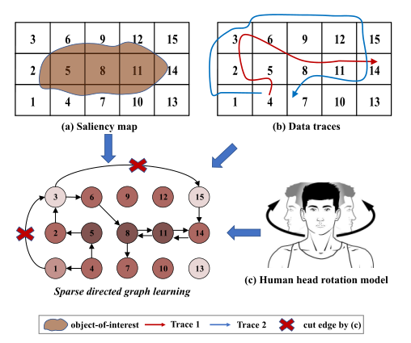

# Graph Learning Based Head Movement Prediction for Interactive 360 Video Streaming（基于graph learning的交互式360视频头部运动预测）
## Abstract
超高清360度视频所编码的质量过大，难以在带宽受限的网络上流畅地流式传输。  
一种流行的方法是在头戴式设备中交互式地提取并发送泳裤当前观看的区域即(FOV)，以获得更有效的传输流。  
由于服务器和客户端存在网络延迟，因此必须要对未来一段时间Fov进行预测。  
本文将Fov预测任务转换为稀疏有向图学习问题：**采集用户的头部运动轨迹、采集360度图像显著性图、一个生物人类头部模型，使用马尔科夫模型进行处理**。  
具体而言，上述三个信息源定义了一个具有相似性和先验条件的约束最大后验问题(MAP)，采用迭代重加权最小二乘(IRLS)和Frank-Wolfe(FW)混合优化策略求解MAP问题。  
## Introduction
受益于当前相机技术和图像拼接技术，高质量的360视频可以在头戴式设备上进行观看。然而360视频需要非常高的分辨率(10k 10240 x 4320)，这就导致难以被用户所稳定观看。  
一种流行的方法是在流媒体传输过程中仅传输当前观看者需要观看的区域。ISO/IEC MPEG推出了MPEG-I标准，指定了媒体传输链，强调了视口的随机访问，它进一步验证了该方法的可行性。  
然而，在真实的网络中，服务器和客户端的RTT可能是很大的，这意味着交互式流媒体系统需要一个头部运动预测来预测用户未来的视口，过往的算法对时间尺度都极为敏感，在RTT增大时，预测精度急剧下降。  
另一种是基于数据驱动的机器学习方法通过神经网络进行预测，从数据中收集到传感器和视频内容信息，然而这样的方法需要训练大量网络参数，同时需要大规模的数据集，导致模型不灵活，难以实践。  
一般而言，预测观察者的兴趣是一个visual attention(VA)问题，出现了不同的VA模型：
1. 基于头部运动的显著性模型；
2. 基于运动的显著性模型；
3. 预测头部凝视数据序列模型；
4. 通过头部和眼球运动数据进行预测的扫描路径模型

头部转动预测模型要预测未来至少一个RTT(通常是50到300毫秒)，本文将预测任务转化为一个稀疏有向图学习问题。  
  
首先将360度视频的所有区域进行分割，上图分割为了16个块。子图a代表图像的显著性区域；子图b代表提前获取的其他用户的轨迹信息；子图c代表当前观看用户的轨迹信息。  
将问题转化为视图块的转移概率问题，进行求解。  

## Related Work
相关的研究主要介绍显著性检测和头部运动预测两个部分。
### 显著性检测 Saliency Detection
显著性检测有多种策略，基于规则的、人工特征提取、基于深度神经网络的等等。  
### 头部运动预测 Head Movement Prediction
最典型的头部运动方法是线性回归LR，同时也有一些KNN的方法，最近还有基于强化学习和LSTM的工作。  