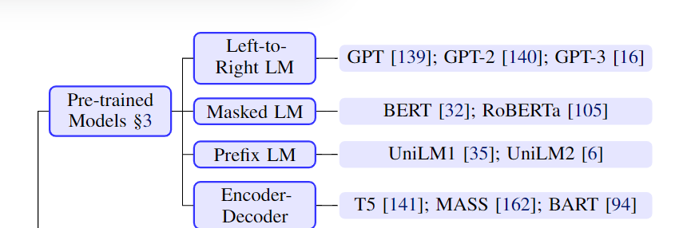

- [Pre-train, Prompt, and Predict: A Systematic Survey of Prompting Methods in Natural Language Processing](#pre-train-prompt-and-predict-a-systematic-survey-of-prompting-methods-in-natural-language-processing)
  - [NLP的两大巨变](#nlp的两大巨变)
  - [Prompt的符号化描述](#prompt的符号化描述)
    - [NLP中的有监督学习](#nlp中的有监督学习)
    - [prompt](#prompt)
    - [prompt的三步](#prompt的三步)
      - [Prompt Addition 提示添加](#prompt-addition-提示添加)
      - [Answer Search 回答搜索](#answer-search-回答搜索)
      - [Answer Mapping 回答映射](#answer-mapping-回答映射)
    - [prompt设计的考虑](#prompt设计的考虑)
  - [pre-train LM 预训练的语言模型](#pre-train-lm-预训练的语言模型)
    - [training objectives 训练目标](#training-objectives-训练目标)
      - [Standard Language Model(SLM) 标准语言模型](#standard-language-modelslm-标准语言模型)
      - [Corrupted Text Reconstruction(CTR) 损坏文本重建](#corrupted-text-reconstructionctr-损坏文本重建)
      - [Full Text Reconstruction(FTR) 全文本重构](#full-text-reconstructionftr-全文本重构)
    - [nosing functions nosing的方法](#nosing-functions-nosing的方法)
    - [文本表示的方向](#文本表示的方向)
    - [典型的pre-train model](#典型的pre-train-model)
      - [left-to-right language model](#left-to-right-language-model)
      - [masked language model](#masked-language-model)
      - [prefix and encoder-decoder](#prefix-and-encoder-decoder)
  - [Prompt Engineering](#prompt-engineering)
    - [Prompt Shape](#prompt-shape)
    - [Manual Template Engineering](#manual-template-engineering)
    - [Automated Template Learning](#automated-template-learning)
      - [Discrete Prompts](#discrete-prompts)
      - [Continuous Prompts](#continuous-prompts)
        - [Prefix Tuning](#prefix-tuning)
        - [Tuning Initialized With Discrete Prompts](#tuning-initialized-with-discrete-prompts)
        - [Hard-soft prompt Hybrid Tuning](#hard-soft-prompt-hybrid-tuning)
  - [Answer Engineering](#answer-engineering)
    - [Answer Shape](#answer-shape)
    - [Answer Space Design Methods](#answer-space-design-methods)
      - [Manual Design](#manual-design)
      - [Discrete Answer Search](#discrete-answer-search)
      - [Continuous Answer Search](#continuous-answer-search)
  - [Multi-Prompt Learning](#multi-prompt-learning)
    - [Prompt Ensembling](#prompt-ensembling)
    - [Prompt Augmentation](#prompt-augmentation)
      - [Sample Selection](#sample-selection)
      - [Sample Order](#sample-order)
    - [Prompt Composition](#prompt-composition)
    - [Prompt Decomposition](#prompt-decomposition)
  - [Training Strategies for Prompting Methods](#training-strategies-for-prompting-methods)
    - [Parameter Update Methods](#parameter-update-methods)
  - [Application](#application)
    - [Knowledge Probing 知识探索](#knowledge-probing-知识探索)
    - [Classification-based Tasks](#classification-based-tasks)
    - [Information Extraction](#information-extraction)
    - ["Reasoning" in NLP](#reasoning-in-nlp)
    - [Question Answering](#question-answering)
    - [Text Generation](#text-generation)
    - [Automatic Evaluation of Text Generation](#automatic-evaluation-of-text-generation)
    - [Multi-modal Learning](#multi-modal-learning)
# Pre-train, Prompt, and Predict: A Systematic Survey of Prompting Methods in Natural Language Processing

## NLP的两大巨变
任务明确并带有输入-输出模式的**完全有监督学习**很长时间一直是NLP的中心  
1. 第一范式：feature engineering特征工程。由于完全有监督的数据集并不能直接达到模型需要的要求，早期的NLP模型往往十分依赖**特征工程**的效果  
2. 第二范式：architecture engineering架构工程。之后随着神经网络在NLP中大量使用，人们开始聚焦于**架构工程**，通过设计有助于任务的网络模型进行NLP任务  
3. 第三范式：objective engineering目标工程。pre-train fine-tune模式在2017-2019成为了NLP的主流方法。其中预训练模型是固定的，即预测文本数据的概率。  
   这种预训练的模式的原始预料非常好获取且不用进行过多的标注，通过大量语料的训练，这个预训练模型十分强大。  
   之后预训练的模型就可以fine-tune 通过添加一些参数，调整应用到各类下游任务中。通过定义预训练和微调部分的**目标任务**，进行NLP。
4. 第四范式：prompt engineering提示工程。prompt learning的理念是不要pre-train的模型去迎合下游任务，而是将下游任务改造，去迎合pre-train的模型的训练方法。

四种范式的图示：  
  
Task Relation描述了LM和NLP任务的关系 第一范式和第二范式中 LM和NLP任务比较独立 没有先后关系  
在第三范式中 先得到LM 再将其作为基础 应用在不同的NLP任务中 GEN生成任务就直接符合 其他任务需要一些微调  
在第四范式中 则是将不同的任务 转变为文本提示(prompt) 进而将问题转化为LM的形式  

## Prompt的符号化描述
### NLP中的有监督学习
在传统有监督学习的NLP任务中，一般有一个**输入input x** 通常为文本，去生成一个**输出 output y**，这个过程基于一个**模型P(y|x;θ)**  
这个y，可以是标签 文本等很多输出。在学习模型参数θ的过程中，人们使用有**标签的成对输入输出**，去拟合这个概率。  
### prompt
完全有监督学习的问题很明显，**海量的有标签数据并不容易获得**。  
prompt-based方法尝试规避这个问题，通过学习一个language model, 来获得text x本身的概率，用其来表征P(x;θ)；通过这个概率去预测y，这样的方法消除了对大的有标签数据集的依赖。  
用以数学表示prompt的元素：  
  
### prompt的三步
#### Prompt Addition 提示添加
prompt addition通过一个f_prompt(·)用以将输入文本x，转变为prompt x' = f_prompt(x) 一般而言有两步：
1. 填充一个模板 template 这个模板是一个文本字符串，缺省了两个位置，[X]表示缺省的输入 [Z]表示缺省的中间表示(这个中间表示最终要被映射到输出y)  
2. 使用真实的输入x 去填充缺省的[X]部分

举例:  
如果输入x是"I love this movie."  
在情感分析任务中，模板就是"[X] Overall, it was a [Z] movie." 那么x'就变成了"I love this movie. Overall it was a [Z] movie."  
在机器翻译任务中，模板就是"English:[X], Chinese:[Z]."  
一般而言不同的任务对应不同的模板和不同的answer[Z]：  
  
注意:  
1. **根据所要填写的[Z]的位置不同，将[Z]在文本中间的称为cloze prompt(完形填空-prompt)，将[Z]在文本末端的称为prefix prompt(前缀-prompt)**  
2. 很多情况下，template并不一定由自然语言组成 可以是很多别的形式 如数字id等  
3. [X]和[Z]的数量可以根据任务灵活更改

#### Answer Search 回答搜索
在搜索空间中搜索得分最高的文本z^。首先定义[Z]的可取值范围集合Z，Z可以是NLP范围中的几乎所有token(例如翻译任务)，可以是其子集，如情感分析定义为["excellent", "good","OK","bad","horrible"]  
定义函数f_fill(x', z)表示在根据prompt x'填空[Z]，[Z]的取值范围是回答集合Z  将任何一个这个过程的prompt称为**filled prompt**  
特别地，如果prompt回答对了就称之为**answered prompt**(对应最上面的样例表)  
那么answer search就可以描述为使用预训练的language model在候选集合Z中，计算各个候选项的的概率，公式化表示如下：  
  
结果z^可以是得分最高的argmax或者sampling根据概率进行采样  

#### Answer Mapping 回答映射
最后一步，将得到的得分最高的answer z^映射为得分最高的output y^  
有些任务中，没有这一步，如翻译任务；有些任务时存在这一步的。  
同时这个映射往往存在多个输出映射到同一个output上的，如情感强度分析中，"excellent" "fabulous" "wonderful" 都对应了强度("++")  

### prompt设计的考虑
后续的焦点就是在如何设计实现prompt 需要考虑以下内容：
1. pre-train模型的选择
2. prompt engineering 如何选择提示函数f_prompt(x) 针对不同的任务选择合适的prompt
3. answer engineering 设计不同的回答候选集Z
4. 改进结果或者增强适用性
5. prompt-based模型训练方法

## pre-train LM 预训练的语言模型
主要通过两个方面来总结pre-trained LM:
1. 以不同的轴axes进行总结
2. 聚焦于prompting methods的各个方面细讲

介绍的模型按照以下几个维度划分：主要的训练目标object, 文本nosing的种类, 辅助训练目标, attention mask, 典型的架构, 喜欢的应用场景  
**在本文的结构中，总结了三种：训练目标、noising方法、文本表示方向三种类型，并介绍了典型的网络模型**  
  
### training objectives 训练目标
pre-trained LM的主要训练对象几乎都是来预测文本x的概率  
#### Standard Language Model(SLM) 标准语言模型
训练模型以优化语料库中文本的概率P(x)，通常通过**autoregressive自回归**的方法进行训练，即**顺序性**地进行token的预测 一般而言是从左到右的 当然也有一些别的顺序的  
除了SLM之外，一个流行的方法是**denosing objectives**,通过对输入x采用一些noising函数 x~= f_noise(x),之后根据noised之后的文本，进行原始输入x的预测
即P(x|x ~)  
一般而言有两种denosing objectives的方法：CTR FTR
#### Corrupted Text Reconstruction(CTR) 损坏文本重建
这种方法训练的目标是仅通过计算输入句子中 noised部分的loss 将文本进行恢复到未nosing的状态  
#### Full Text Reconstruction(FTR) 全文本重构
训练目标是计算整个句子的loss 无论是否noised过  

总结而言，pre-trained LM的训练方法对后续的prompt的影响很大。  
如left-to-right autoregressive的LM适合于prefix prompts即前缀提示  
而重构类的LM则适合于cloze prompts即完形填空  
生成性的任务一般适合于SLM和FTR作为目标的LM 而其他任务一般而言都可以  

### nosing functions nosing的方法
对于reconstruction类型的训练目标来说，如何使用nosing堆机器学习算法的效果很有影响。  
**同时，如果在训练pre-train model时有意的将名词对象进行nosing，那么可能就非常适合针对预测名词对象预测任务的场景**  
nosing方法的图示：  
  
1. **masking** masking的方法是在多种level(一个或者多个或者特定对象)上，将其替换为一个特定的token [MASK]  
   **值得注意的是，masking的方法可以是随机的，也可以是有针对性的，如针对于预测名词的masking方法**  
2. **replacement** 替换的方法和masking类似，只不过是把[MASK] token 替换为了另一个token或者信息
3. **deletion** 直接对一个或多个token进行删除 注意这种方法比较适合FTR类的方法
4. **permutation** 首先将文本划分为一定的维度(如token 子句或者句子)，之后对其进行排列得到新的文本(类似于SOP sentence order prediction)

### 文本表示的方向
计算的方向性也是区分不同LM的重要因素。一般而言有两种
1. **left-to-right** 这种计算中，当前token的生成依赖于当前token本身和之前的tokens 这种方式被广泛应用在SLM和计算FTR的输出时
2. **bidirectional** 双向的 这种表示方法计算过程中依赖于双向的信息

除了这两种基本的表示方向外，也有一些变种，如：将两种模式混合到一个模型中；将token的顺序进行随机排序；  
注意这些方式的实现方法一般是attention mask 就是在计算self-attention时，采用灵活多变的mask方式，以下是几种attention-mask的方式  
  
如上图，full代表self-attention时，每一步都可以计算所有的输入；diagonal对角线方法是每一步只能看到时间片上靠前的部分；mixed的方法就是自定义的。  

### 典型的pre-train model
总结而言，不同的pre-train model的主要区分点在以上三个部分：训练目标、nosing方法、文本表示方向三种。  
根据这些标准，介绍典型的pre-train模型 分为left-to-right, masked, prefix, encoder-decoder  
各种pre-train model训练模式的简要图示：  
  
各种pre-train model的简要结构介绍：  
  
其中x,y代表encode的text和decode的text SLM standard language model, CTR corrupted text reconstruction, FTR full text reconstruction  
#### left-to-right language model
Left-to-Right Language Model(L2R LMs) 是一种autoregressive自回归模型，预测当前token或者给出一个序列的概率P(**x**) **x** = x1, x2,... xn  
这个预测或者概率的计算，一般通过链式法则从左到右进行逐步计算即：*P(x)=P(x1)XP(x2|x1)...XP(xn|x1,x2...xn-1)* 即从x1开始不断计算条件概率，最终计算n个token结束  
类似地，right-to-left的计算表达式就是*P(xi|xi+1,xi+2...xn)*通过i+1...到n的信息，计算当前位置i的概率  
**典型模型：**  
GPT-3, GPT-Neo  
**应用场景：**  
L2R方法常常是prompt的核心网络。这样做的一个实际的原因是一般L2R网络都非常庞大，耗费大量资源和财力；所以这种在pre-train fine-tune模式似乎并不可能  
**总结而言：**  
L2R在对于输入text x的方法中，使用的是diagonal对角线mask方法，无noise，主要的模式是标准语言模型SLM 没有对输出text y的处理；  
训练的方法就是生成和数据库中相同的语料进行训练。  

#### masked language model
自回归autoregressive模型在表征文本概率上或者说生成性的任务上十分有效；但是它们要求从左向右进行生成的原则也有缺陷。如果要将它们应用在下游的一个分类任务上时，本质上可以跳出left-to-right的限制。  
这样就有了双向的language model，其中具有代表性的就是masked language model，其用来根据上下文的信息，去预测masked tokens  
即*P(xi|x1,x2...xi-1,xi+1,...xn)*根据除了xi以外的上下文信息，计算xi的条件概率分布  
**典型模型：**  
BERT, ERNIE  
**应用场景：**  
在prompt的场景中，MLM最适合用在自然语义理解或分析任务，如：文本分类，自然语言推理和抽取式的问答任务；  
究其原因，应该是这些任务往往比较适合于改造成完形填空cloze的任务，这样和MLM的训练方式如出一辙；  
另外，将prompt和fine-tune任务结合时，MLM也是首选  
**总结而言：**  
MLM对输入text x的处理是采用full mask，即每一步都可以考虑全局信息；noise方法采用MASK，将token隐去的方法；训练方式是CTR损坏部分的重构方法；对输出text y没有处理；  
训练方法就是对一些token进行mask，那么就是已知真实值，进行训练还原，完形填空  

#### prefix and encoder-decoder
在类似于文本翻译和文本总结的任务中，给定输入文本**x** = x1, x2, ...xn，目标是生成文本**y**。一般而言，这要求模型具有encode输入文本和decode输出文本的能力。  
一般而言是一种固定的模式：  
1. 使用一个encoder，encoder中是full-mask的，即可以全局考虑信息，通过encoder进行对输入文本**x**的编码；
2. 使用一个decoder，通过left-to-right(autoregressive)的方法，进行生成解码；

**prefix language model：**  
prefix language model是一个根据一个prefix sequence x，进行left-to-right decode解码y的模型，**其中prefix sequence x是通过通过相同的模型参数(一个self-attention网络进行处理)encode，同时是full-mask的**  
换句话说，可以从图中看到，对prefix sequence x的计算是full-mask的，能掌握全局信息；在生成y的部分，是部分可见，只能看到sequence维度上，靠前的信息；所有的输入进入self-attention网络，通过mask的技术，进行生成；  
值得注意的是，往往为了提高prefix LM对输入prefix获得更好的表达，常常在输入text x上使用CTR损坏文本重建，在输出文本y上使用SLM 标准的生成式decode方法  

**Encoder-Decoder**  
encoder-decoder模型同样是根据输入sequence x 通过left-to-right decode解码y的模型，但是和prefix LM不一样的是，其encoder部分和decoder部分是分离的，encoder部分采用一个独立的full-mask方法进行特征提取，encoder的参数和decoder并不共享，类似地，也可以在输入x上进行重建形式的方法；  
**典型模型：**  
prefix LM: UniLM 1-2,  ERNIE-M  
encoder-decoder: BART, MASS, T5  
**应用场景：**  
prefix LM和encoder-decoder 一般用在文本生成的prompt任务上；同时通过合适的prompt，还可以用在信息抽取，QA，文本生成评估任务中；  
**总结而言：**  
prefix LM对输入text x采用full mask,可以全局考虑，任何noise都可以使用；训练时使用一个CTR任务可以增加信息抽取能力；对输出text y使用对角线diagonal mask，即只能考虑前面的信息，任务就是SLM；  
encoder-decoder任务对输入text x采用采用full mask,可以全局考虑，noise可以使用也可以不使用，训练时一般不用额外任务；对输出text y使用对角线diagonal mask，即只能考虑前面的信息，任务是进行FTR/CTR；  

## Prompt Engineering
Prompt engineering是创建提示函数f_prompt(x)，使得下游任务处理更加高效。  
prompt engineering要考虑两点，首先是prompt shape 之后确定是否是manual or automated 进行创建prompt  
  

### Prompt Shape
主要有两种prompt的方法：cloze prompts(完形填空 通过填充文本中的空缺进行prompt) prefix prompts(前缀提示 将文本作为上文，进行提示，生成后续文本)  
选择哪种方法取决于任务和解决任务的模型：
1. 对于生成迭代性的任务，或者需要使用标准auto-regressive LM时，prefix prompts往往比较好
2. 对于需要masked LM解决的任务，cloze prompt比较好，因为这就迎合了Masked LM的预训练过程
3. 对于设计多个输入的任务，如文本对分类任务等，prompt 的模板往往需要两个输入[X1] 和 [X2]

### Manual Template Engineering
prompt的创建方式中，人类手动创造基于人类理解的模板最为直接。  
有很多数据集是在这方面进行构建的。如LAMA dataset等  

### Automated Template Learning
人类手动创建prompt最为直接，而且确实在一些场景中准确率不错，但是仍有一些问题：
1. 创建和实验prompt是一门需要时间和经验的工作，尤其是对于一些复杂的任务
2. 即便具有丰富经验的prompt designers 也可能无法得到最优的prompt

自动化prompt template可以分为：
1. **discrete prompts离散提示**。prompt是文本字符串
2. **continuous prompts连续提示**。prompt直接在底层LM的embedding space中进行

prompt又可以分为静态的static和动态地dynamic，静态的是说对于所有输入，有同样的prompt template；动态的是说对于不同的输入，有不同的prompt template  
静态-动态和离散-连续是正交的，在后续有所解释。  
#### Discrete Prompts
discrete prompts自动在离散空间寻找模板，通常对应自然语言短语，有以下几种细分：
1. **Prompt Mining 提示挖掘**。 本方法是在给定输入x和输出y的情况下，自动地寻找模板。  
   这种方法从海量语料库中提取包含x和y的字符串，查找输入和输出之间的中间词(middle words)或者依赖路径(dependency paths)  
   最终得到模式：[X] middle words [Z]  
2. **Prompt Paraphrasing 提示解码**。 本方法是采用现有的种子提示seed prompt 将其解码为一组候选提示，之后选择在目标任务中得到效果最好的提示。  
   Paraphrasing的方法有很多如：将提示翻译成另一种语言再翻译回来；使用同义库中的短语替换；使用专门优化的神经提示重写器。  
3. **Gradient-based Search 基于梯度搜索**。这是一种对实际token应用基于梯度的搜索策略，找到能够触发底层pre-train LM，以生成目标预测的方法。
4. **Prompt Generation 提示生成**。一些人讲prompts的生成又当做了一个文本生成任务，使用标准的生成模型进行处理。  
   例如有人使用T5模型进行prompt的生成：指定插入模板标记的位置/为T5提供样本去解码template tokens
5. **Prompt Scoring 提示打分** 。 设计head-relations-tail三元组作为template输入LM，首先人工填空input和answer 将prompt部分空出，之后使用单向LM进行生成prompt，得到概率最高的template  

#### Continuous Prompts
**由于prompt的构造目的是尽可能地发挥LM的能力，而不是需要人类使用，所以没有必要将prompt限制为人类可以理解的自然语言。**  
continuous prompt是直接在LM的embedding空间中进行prompt，具体来说，continuous prompt摆脱了两个约束：
1. 摆脱了prompt是自然语言文字的约束，使用的是embedding
2. 摆脱了template必须由pre-trained LM参数化的限制

templates有自己的参数，可以根据下游任务的数据自动地切换。  
##### Prefix Tuning
Prefix Tuning是一种将一个连续的，用于特定任务的向量，添加到模型输入前面，同时将LM的参数frozen  
数学上来讲，就是在给定可训练前缀矩阵prefix matrix M_φ和固定的pre-trained LM参数θ的情况下，使得x和y得到极大似然估计。即：  
  
其中h_< i是时间维度上的网络状态。就是要在给定θ 和 样本集x y的情况下，训练前缀矩阵的参数φ，获得极大似然估计，或者说误差最小。  

##### Tuning Initialized With Discrete Prompts
使用已经创建或发现的discrete prompts离散提示形式的提示进行初始化，去搜索连续性的提示。  
本质上而言，就是对continuous prompts提供了一个好的搜索起始点，这个起始点由discrete prompts提供  

##### Hard-soft prompt Hybrid Tuning
该类方法不使用可以学习的prompt template，而是将一些可训练的embeddings嵌入hard prompt template中。  
有人使用BiLSTM的输出作为embedding进行嵌入

## Answer Engineering
prompt engineering是考虑如何设置f_prompt(x) 作为LM的输入，最大程度发挥pre-trained LM的能力，迎合预训练过程。  
answer engineering是考虑在可取值的answer space回答空间Z中搜索结果，并将其映射到原始输出y上，生成有效的预测模型。  
  
### Answer Shape
answer的shape就是它的粒度，就是回答的表示形式，主要有三种：
1. **Tokens** token指的是pre-trained LM的vocab的一个词
2. **Span** 一个短的tokens段，通常与cloze prompt结合
3. **Sentence** 一个句子或文本 通常与prefix prompt相结合

实际上，如何选择answer的粒度基本取决于具体的任务：
1. token/text-span往往被用在分类任务、关系抽取任务和命名实体识别任务上
2. longer phrasal/sentence 往往用在文本生成任务、多选择QA任务

### Answer Space Design Methods
得到了answer的粒度之后，需要确定搜索空间Z，还要确定如果Z不是最终的输出空间，如何将Z映射到输出空间y中  
#### Manual Design
手动设计分为以下两种：
1. **Unconstrained Spaces 无约束空间**。 无约束空间很明显就是all tokens或者token sequences 这种情况下，往往直接将搜索空间Z 映射到输出空间y上去
2. **Constrained Spaces 有约束空间**。 这种有约束的空间往往发生在带有优先标签的文本分类任务、情感识别任务或者多选择的QA任务中。  
   例如文本分类任务的搜索空间只有一些特定的tokens: health finance politics sports等 情感识别任务的搜索空间只有:anger joy sadness fear等  
   这种情况下，从搜索空间Z到输出空间y的映射是必要的

#### Discrete Answer Search
手动设计的不一定是最优的，也可以使用自动化的搜索策略  
1. **Answer Paraphrasing** 从一个初始答案空间Z'开始，通过paraph的方法扩展索索空间。通过一个初始的answer-output对Z'-y，定义一个扩展函数，得到一个Z'生成的集合para(z')  
   最终的p(y|x)是所有para(z')的边界概率之和sum(P(z|x))  这种候选域的扩展可以使用多种方法，如：翻译到另一个语言，再翻译回来，得到了多种候选翻译结果。  
2. **Prune-then-Search** 修剪后搜索。首先生成一个由一个或多个可能答案Z'修剪后的答案空间，然后算法进一步搜索该空间得到最终答案集合。  
3. **Label Decomposition** 标签分解。在进行关系提取时，可以将每个关系标签分解为其组成词，作为answer，如per:city_of_death 那么分解后就是{person, city, death}

#### Continuous Answer Search
有特别少的工作使用可以被梯度下降优化的软搜索tokens。有一些学者用虚拟token代表label进行分类，使用token的embedding进行分类，这样就可以进行优化。  

## Multi-Prompt Learning
大量研究表明，使用多提示multi-prompt可以提高prompt learning的效果  
一般而言可以分为Prompt Ensembling(提示合并) prompt Augmentation(提示增强) Prompt Composition(提示组合) Prompt Decomposition(提示分解)  
  
### Prompt Ensembling
**提示合并是通过使用多个未回答的prompts作为输入同时进行预测**  
  
如图所示，对同一个输入使用三个目标一致效果类似的Prompt进行处理。  
效果主要有：
1. 利用不同提示的优势进行互补
2. 降低提示工程的成本，因为选择单个性能最好的提示代价很大，不如一起使用
3. 稳定下游任务的性能

如何将多个提示进行结合，又可以分为以下五种
1. **Uniform Averaging** 最为直观的方法是取不同提示的概率平均值，将多个prompt在搜索空间Z上每个候选项的概率取平均值，进行最终结果选取。P(z|x) = average(P(z|f_prompt_i(x)))  
2. **Weighted Averaging** 有些提示的效果好 有些不好 所以可以进行加权和 权重可以预先指定，也可以使用训练集进行优化
3. **Majority Voting** 分类任务可以进行投票
4. **Knowledge distillation** 知识蒸馏。深度学习模型可以使用知识蒸馏将多个卓越性能的模型提炼成单个模型。
5. **Prompt ensembling for text generation** 生成任务的提示组合方法较少，这种情况下一种简单的方式是使用基于答案序列中下一个token生成概率的平均值进行处理。

### Prompt Augmentation
**提示增强，有时也称为演示学习，提供了一些已回答的提示answered prompt用于演示如何为输入x提供答案。**  
  
这个图有些生动讲解了提示增强，输入：计算6和8的和，一个已回答的提示1+1=2 另一个已回答的提示2+5=9 当前提示：6+8=[MASK]  
另一个例子：如果提示是"China's capital is [Z]" 那么可以给"Great Britain's capital is London." "Japan's capital is Tokyo." "China's capital is [Z]"  
虽然prompt augmentation的思想很简单，但是其有衍生出了两个新的问题：
1. Sample Selection：如何选择有效的增强回答？
2. Sample Ordering：如何对被选择的增强回答进行排序

#### Sample Selection
在小样本学习中，所选择的提示性的样例的不同，会直接导致最终模型的效果不同，有些样例导致了SOTA的效果，有些样例甚至导致模型成了为随机猜测  
有些人使用embedding进行处理 有些人选择正负样本进行处理  

#### Sample Order
对于answered prompts的顺序选择，对最终的模型性能会有影响。  
归根结底就是一个排序模型，可以通过多种机器学习方法进行处理。  

### Prompt Composition
提示组合是说对于使用多个sub-prompts进行组合，对于任务来说，根据这些sub-prompts构件合适的prompts  
  
例如，旨在提取两个实体关系的任务中，可以将任务分解为几个子任务，包括识别实体的特征和分类实体的关系，最终得到目标。  

### Prompt Decomposition
需要对一个样本进行多个预测的任务(如词性标注)，直接定义关于整个输入文本你的prompt是很难的。  
解决的方法是将整个prompt分解为不同的sub-prompts 之后分别对sub-prompt进行回答  
  

## Training Strategies for Prompting Methods
研究与prompting methods一致的显式模型训练方法  
  
**大多数情况下，prompting methods在没有对下游任务有任何显式训练的情况下，就可以使用；只需要将下游任务迎合到适合的LM上，使用cloze或prefix prompts的方法即可**  
**这被成为zero-shot setting，因为对下游任务没有任何额外数据。**  
但是，也有一些方法使用训练数据与提示方法一起训练模型。包括full-data learning(有大量数据进行训练) 和 few-shot learning(使用少量的样本进行训练)  
**prompt methods在小样本学习上很有用，因为通常是没有足够的训练实例来训练**  

### Parameter Update Methods
**在基于prompt的下游任务中，通常由两类参数：pre-trained models的参数和prompts的参数 哪部分的参数应该更新时非常重要的，这会导致不同场景下有不同的适用性。**  
可以按照三个方面进行讨论：
1. 底层的LM参数是否被调整；
2. 是否有额外的prompt-related 参数；
3. 如果有额外的prompt-related 参数，它们是否会被调整

  
1. Promptless Fine-tuning 无提示的fine-tuning方法  
在prompt流行之前 pre-train fine-tune模式就已经在NLP领域十分流行  
预训练模型LM的全部或部分参数，会根据下游任务的样本进行更新  
**样例： BERT RoBERTa等**  
这是简单、强大且广泛使用的方法，但是可能在小数据集上发生或拟合或灾难性遗忘(LM失去了微调之前的能力)  
**优点：简单、无需prompt、修改LM的所有参数可以让模型适合大数据集；**  
**缺点：在小型数据集上可能会过拟合或者不稳定**  

2. Tuning-free Prompting  
Tuning-free的方法不修改pre-trained LM的参数，仅仅基于prompt直接生成answer  
可以通过上一章的方法，增加input，这种tuning-free prompting和prompt augmentation又被称为in-context learning  
**样例：LAMA GPT3等**  
**优点：高效，没有参数更新，不会产生遗忘(因为LM的参数固定) 可以使用在zero-shot setting中**  
**缺点：因为prompts是进行任务的唯一方法，那么需要大量的工程来实现高精度；特别是在in-context learning中，提供很多answered prompts会耗费大量时间**  

3. Fixed-LM Prompt Tuning  
在引入了prompt-relevant parameters的任务中，将LM的参数固定不变，仅仅通过下游任务的数据，对prompts的参数进行调整  
**样例：Prefix-Tuning WARP**  
**优点：类似于tuning-free prompting，可以保留LM的内容，适用于小样本场景，而且通常比tuning-free的效果好一些**  
**缺点：无法在零样本场景中使用，虽然在小样本场景中有效，但表达能力有限。通常还需要调整超参数和seed prompts。prompts往往不是人类可解释或可操作的。**  

4. Fixed-prompt LM Tuning  
fixed-prompt LM tuning方法是按照pre-train fine-tune范式一样，对LM的参数进行更新，同时加入固定参数的prompt进行指定模型行为。  
最自然的方法是提供一个离线的文本模板，应用在每个训练和测试用例上。  
**样例：PET-TC PET-Gen LM-BFF**  
**优点：prompt engineering或者answer engineering全面指定任务，允许更有效地学习**  
**缺点：需要prompt engineering或者answer engineering。对一项下游任务微调的LM可能对另一个任务毫无作用。**  

5. prompt + LM Tuning  
在这种场景中，prompt-relevant parameters和LM的参数可以一起微调。  
样例：PADA P-Tuning  
优点：最具表现力的方法，适用于high-data setting  
缺点：需要训练和存储模型的所有参数，可能在小数据集上过拟合  

## Application
prompt learning的应用  
### Knowledge Probing 知识探索
**Factual Probing 事实探查(a.k.a fact retrieval事实检索)**是最早使用prompt的场景之一  
探索这项任务的动机是量化预训练的LM的内部表征包含的事实知识  
**预训练模型的参数通常是固定的，通过将原始输入转换为完形填空来检索知识，完形填空的prompt可以手动制作或自动生成**  
相关数据集包括LAMA和X-FACTR等。由于答案是pre-defined，事实检索任务只关注与找到有效的模板，并根据这些模板分析不同的结果  
**Linguistic Probing 语言探索**  
大规模的pre-training允许LM处理语言现象，例如类比，否定，语义相似性，稀有词理解等  
### Classification-based Tasks
基于prompt的分类任务十分广泛，在这类任务中，prompt templates提示模板相对容易地构造  
基于分类任务的关键是制定合适的提示，例如使用"the topic of this document is [Z]" 之后使用pre-trained LM进行填空  
**Text Classification 文本分类**  
对于文本分类任务，大多数都使用完形填空方法，同时使用prompt engineering和answer engineering  
当前的研究点都是在fixed-prompt LM Tuning的策略下，探索小样本分类fine-tune的效果  
**Natural Language Inference(NLI) 自然语言推理**  
自然语言推理进行预测两个指定句子之间的关系(如蕴含关系)  
通常使用完形填空方法，关于prompt engineering，研究员要关注小样本环境下的模板探索 answer space Z通常是手动选定的  

### Information Extraction
信息抽取不同于一般分类任务，其需要很多技巧去构造prompts  
**Relation Extraction 关系提取**  
关系提取是预测两个实体之间的关系的任务  
**Semantic Parsing 语义分析**
语义分析是在给定自然语言输入的情况下生成结构化含义的任务  
**Named Entity Recognition 命名实体识别**  
命名实体识别是识别给定句子的命名实体(person, name, location)的任务  

### "Reasoning" in NLP
**Commonsense Reasoning 常识推理**  
The trophy doesn’t fit into the brown suitcase because it is too large  
对于模型来说，就是要分辨it代指哪个物体  
**Mathematical Reasoning 数学推理**
f(x) = x * x what is f(f(3))  
类似的任务  

### Question Answering
QA 问答任务是给定输入问题，给出回答，通常是基于上下文文档的。  
QA可以采用多种形式，如抽取式QA(答案在文本中) 选择型QA(从数个选项中进行选择) 自由形式QA(模型可以返回任意文本字符)  

### Text Generation
文本生成是涉及生成性文本你的一系列任务，通常以其他一些信息为条件，使用前缀提示和自回归的云训练模型做  

### Automatic Evaluation of Text Generation
prompt learning可以用于自动评估生成的文本  

### Multi-modal Learning
采用固定的fixed-LM prompt tuning策略，结合prompt augmentation技术  
为每个图像表示为一个embedding 并使用pre-trained LM，将其参数固定，使用prefix的方法进行prompt 最终生成文本(如图像标题)  
在一些answered prompts的帮助下，系统可以快速学习新对象和新的视觉类别  
