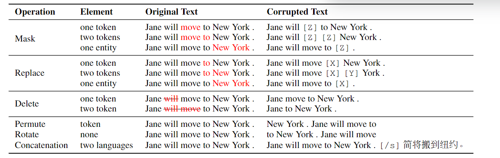

# Pre-train, Prompt, and Predict: A Systematic Survey of Prompting Methods in Natural Language Processing

## NLP的两大巨变
任务明确并带有输入-输出模式的**完全有监督学习**很长时间一直是NLP的中心  
1. 第一范式：feature engineering特征工程。由于完全有监督的数据集并不能直接达到模型需要的要求，早期的NLP模型往往十分依赖**特征工程**的效果  
2. 第二范式：architecture engineering架构工程。之后随着神经网络在NLP中大量使用，人们开始聚焦于**架构工程**，通过设计有助于任务的网络模型进行NLP任务  
3. 第三范式：objective engineering目标工程。pre-train fine-tune模式在2017-2019成为了NLP的主流方法。其中预训练模型是固定的，即预测文本数据的概率。  
   这种预训练的模式的原始预料非常好获取且不用进行过多的标注，通过大量语料的训练，这个预训练模型十分强大。  
   之后预训练的模型就可以fine-tune 通过添加一些参数，调整应用到各类下游任务中。通过定义预训练和微调部分的**目标任务**，进行NLP。
4. 第四范式：prompt engineering提示工程。prompt learning的理念是不要pre-train的模型去迎合下游任务，而是将下游任务改造，去迎合pre-train的模型的训练方法。

四种范式的图示：  
  
Task Relation描述了LM和NLP任务的关系 第一范式和第二范式中 LM和NLP任务比较独立 没有先后关系  
在第三范式中 先得到LM 再将其作为基础 应用在不同的NLP任务中 GEN生成任务就直接符合 其他任务需要一些微调  
在第四范式中 则是将不同的任务 转变为文本提示(prompt) 进而将问题转化为LM的形式  

## Prompt的符号化描述
### NLP中的有监督学习
在传统有监督学习的NLP任务中，一般有一个**输入input x** 通常为文本，去生成一个**输出 output y**，这个过程基于一个**模型P(y|x;θ)**  
这个y，可以是标签 文本等很多输出。在学习模型参数θ的过程中，人们使用有**标签的成对输入输出**，去拟合这个概率。  
### prompt
完全有监督学习的问题很明显，**海量的有标签数据并不容易获得**。  
prompt-based方法尝试规避这个问题，通过学习一个language model, 来获得text x本身的概率，用其来表征P(x;θ)；通过这个概率去预测y，这样的方法消除了对大的有标签数据集的依赖。  
用以数学表示prompt的元素：  
  
### prompt的三步
#### Prompt Addition 提示添加
prompt addition通过一个f_prompt(·)用以将输入文本x，转变为prompt x' = f_prompt(x) 一般而言有两步：
1. 填充一个模板 template 这个模板是一个文本字符串，缺省了两个位置，[X]表示缺省的输入 [Z]表示缺省的中间表示(这个中间表示最终要被映射到输出y)  
2. 使用真实的输入x 去填充缺省的[X]部分

举例:  
如果输入x是"I love this movie."  
在情感分析任务中，模板就是"[X] Overall, it was a [Z] movie." 那么x'就变成了"I love this movie. Overall it was a [Z] movie."  
在机器翻译任务中，模板就是"English:[X], Chinese:[Z]."  
一般而言不同的任务对应不同的模板和不同的answer[Z]：  
  
注意:  
1. **根据所要填写的[Z]的位置不同，将[Z]在文本中间的称为cloze prompt(完形填空-prompt)，将[Z]在文本末端的称为prefix prompt(前缀-prompt)**  
2. 很多情况下，template并不一定由自然语言组成 可以是很多别的形式 如数字id等  
3. [X]和[Z]的数量可以根据任务灵活更改

#### Answer Search 回答搜索
在搜索空间中搜索得分最高的文本z^。首先定义[Z]的可取值范围集合Z，Z可以是NLP范围中的几乎所有token(例如翻译任务)，可以是其子集，如情感分析定义为["excellent", "good","OK","bad","horrible"]  
定义函数f_fill(x', z)表示在根据prompt x'填空[Z]，[Z]的取值范围是回答集合Z  将任何一个这个过程的prompt称为**filled prompt**  
特别地，如果prompt回答对了就称之为**answered prompt**(对应最上面的样例表)  
那么answer search就可以描述为使用预训练的language model在候选集合Z中，计算各个候选项的的概率，公式化表示如下：  
  
结果z^可以是得分最高的argmax或者sampling根据概率进行采样  

#### Answer Mapping 回答映射
最后一步，将得到的得分最高的answer z^映射为得分最高的output y^  
有些任务中，没有这一步，如翻译任务；有些任务时存在这一步的。  
同时这个映射往往存在多个输出映射到同一个output上的，如情感强度分析中，"excellent" "fabulous" "wonderful" 都对应了强度("++")  

### prompt设计的考虑
后续的焦点就是在如何设计实现prompt 需要考虑以下内容：
1. pre-train模型的选择
2. prompt engineering 如何选择提示函数f_prompt(x) 针对不同的任务选择合适的prompt
3. answer engineering 设计不同的回答候选集Z
4. 改进结果或者增强适用性
5. prompt-based模型训练方法

## pre-train LM 预训练的语言模型
主要通过两个方面来总结pre-trained LM:
1. 以不同的轴axes进行总结
2. 聚焦于prompting methods的各个方面细讲

介绍的模型按照以下几个维度划分：主要的训练目标object, 文本nosing的种类, 辅助训练目标, attention mask, 典型的架构, 喜欢的应用场景  
### training objectives 训练目标
pre-trained LM的主要训练对象几乎都是来预测文本x的概率  
#### Standard Language Model(SLM) 标准语言模型
训练模型以优化语料库中文本的概率P(x)，通常通过**autoregressive自回归**的方法进行训练，即**顺序性**地进行token的预测 一般而言是从左到右的 当然也有一些别的顺序的  
除了SLM之外，一个流行的方法是**denosing objectives**,通过对输入x采用一些noising函数 x~= f_noise(x),之后根据noised之后的文本，进行原始输入x的预测
即P(x|x ~)  
一般而言有两种denosing objectives的方法：CTR FTR
#### Corrupted Text Reconstruction(CTR) 损坏文本重建
这种方法训练的目标是仅通过计算输入句子中 noised部分的loss 将文本进行恢复到未nosing的状态  
#### Full Text Reconstruction(FTR) 全文本重构
训练目标是计算整个句子的loss 无论是否noised过  

总结而言，pre-trained LM的训练方法对后续的prompt的影响很大。  
如left-to-right autoregressive的LM适合于prefix prompts即前缀提示  
而重构类的LM则适合于cloze prompts即完形填空  
生成性的任务一般适合于SLM和FTR作为目标的LM 而其他任务一般而言都可以  

### nosing functions nosing的方法
对于reconstruction类型的训练目标来说，如何使用nosing堆机器学习算法的效果很有影响。  
**同时，如果在训练pre-train model时有意的将名词对象进行nosing，那么可能就非常适合针对预测名词对象预测任务的场景**  
nosing方法的图示：  
  
1. masking masking的方法是在多种level(一个或者多个或者特定对象)上，将其替换为一个特定的token [MASK]  
   **值得注意的是，masking的方法可以是随机的，也可以是有针对性的，如针对于预测名词的masking方法**  
2. replacement 替换的方法和masking类似，只不过是把[MASK] token 替换为了另一个token或者信息
3. deletion 直接对一个或多个token进行删除 注意这种方法比较适合FTR类的方法
4. permutation 首先将文本划分为一定的维度(如token 子句或者句子)，之后对其进行排列得到新的文本(类似于SOP sentence order prediction)

### 文本表示的方向
计算的方向性也是区分不同LM的重要因素。一般而言有两种
1. left-to-right 这种计算中，当前token的生成依赖于当前token本身和之前的tokens 这种方式被广泛应用在SLM和计算FTR的输出时
2. bidirectional 双向的 这种表示方法计算过程中依赖于双向的信息

