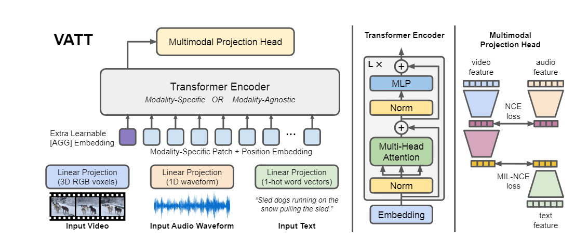
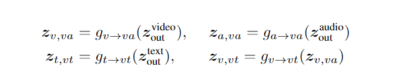
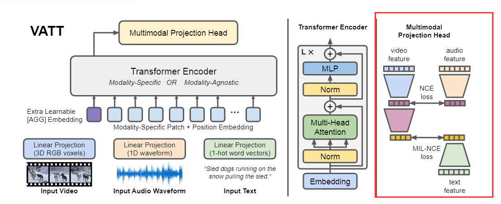
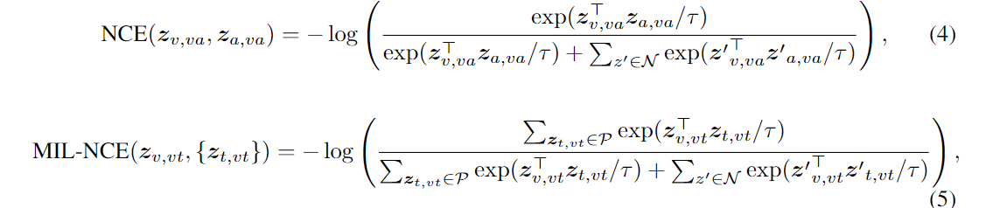

- [VATT: Transformers for Multimodal Self-Supervised Learning from Raw Video, Audio and Text](#vatt-transformers-for-multimodal-self-supervised-learning-from-raw-video-audio-and-text)
  - [ABSTRACT](#abstract)
  - [Introduction](#introduction)
  - [Related Work](#related-work)
    - [Transformers in Vision](#transformers-in-vision)
    - [Self-Supervised Learning](#self-supervised-learning)
    - [Multimodal video](#multimodal-video)
  - [Approach](#approach)
    - [Tokenization and Positional Encoding](#tokenization-and-positional-encoding)
    - [DropToken](#droptoken)
    - [Transformer Architecture](#transformer-architecture)
    - [Common Space Projection](#common-space-projection)
    - [Multimodal Contrastive Learning](#multimodal-contrastive-learning)
# VATT: Transformers for Multimodal Self-Supervised Learning from Raw Video, Audio and Text
## ABSTRACT
本文提出了一种使用无标签数据，不使用卷积结构而使用Transformer结构的多模态表征方式。  
提出的VATT(Video-Audio-Text Transformer)将原始信号作为输入，通过模型，提取出多模态表征，应用于下游任务中。  
此外，通过在三种模态之间共享权重，得到了一种**模态无关的(modality-agnostic) 单主干的(single-backbone)**Transformer  

## Introduction
self-attention在NLP领域取得了显著成功，同时Transformer在图像领域也取得了显著效果  
但是有监督的图像Transformer学习是非常昂贵的，因为要标注大量用于训练的图像数据是很困难的，本文借鉴了NLP领域中self-supervised的理念，从多模态视频中去抽取图片作为数据。  
本文的训练方式是研究**三个自监督的(self-supervised) 多模态预训练的(multimodal pre-training)** Transformer，分别以**RGB帧、waveform和音频对应的文字**作为输入，进行特征提取。  
VATT的架构：  
  
之后，通过一个十分强的限制去挑战Transformers：将视频、音频和文本共享权重，得到一个适合于所有模态的通用Transformer，结果表明模型无关的Transformer和三个比较小的Transformer结果相当  
最后，另一个工作是DropToken，一种简单而有效的技术，通过轻微降低Transformer的性能来降低训练复杂度。DropToken在训练期间从每个输入序列中丢弃一部分视频和音频标记，这样可以降低Transformer的复杂度。  

## Related Work
### Transformers in Vision
Transformer已经成为CNN之后，视觉领域使用最为广泛的基本架构之一。  

### Self-Supervised Learning
早期的self-supervised自监督的图像表征学习往往使用无标签的图像数据，这些无标签的数据往往是认为生成的  
最近使用Vision Transformer的效果很不错，对于视频领域，时间维度是很明显需要考虑的，例如包括预测未来帧、运动估计、编码任务、对帧自动排序等任务  

### Multimodal video
视频是多模态数据的天然来源，多模态的self-supervised learning是很方便的。  

## Approach
VATT的步骤：
### Tokenization and Positional Encoding
VATT作用在原始信号上，原始信号包括RGB视频帧、waveform音频帧、一段文字  
**各个模态都有一个独立的tokenization layer** 通过它来将原始的信号输入，变为一个向量序列，作为后续Transformer的输入。  
同时，**每个模态都有独立的positional encoding**，用以在Transformer中表征位置信息。  
**视频：**  
视频具有(T(time), H(height), W(width))，分为(T/t, H/h, W/w)的序列，那么时间片上具有(t, h, w)的视频，分别有三个通道。  
那么就是得到了一个**t X h X w X 3**的输入信息，最终表示到d维上  
**音频：**  
原始音频是具有T'长度的一维向量，将其划分为t'份，每份得到(T'/t')长度的waveform，同样将其映射到d维上  
**文字：**
文字是使用词表大小为v的one-hot向量，映射到d维上  

### DropToken
DropToken是一种简单有效的策略，可以降低训练复杂度。  
在获得了视频和音频的序列数据之后，随机采样一部分，将采样序列提供给Transformer  
因为Transformer的计算复杂度是O(N2) N是输入序列的token数，减少输入长度的方法都可以直接减少复杂度。  
**使用DropToken的原理是因为图像和音频可能包含大量冗余**。  

### Transformer Architecture
采用最成熟的Transformer架构  
输入使用[X_AGG; X0WP; X1WP,... XNWP] + positional encoding  
X0，X1, XN是序列上每个时间点的输入  

### Common Space Projection
在公共空间使用公共空间投影和对比学习来训练模型。给定一个video-audio-text三元组，定义了一个语义分层的公共空间映射，能够直接计算video-text pair和video-audio pair的余弦相似度  
**当我们假设多模态具有不同的语义粒度时，这种方法比较可行。**  
  
g(v->va)表示从video空间映射到video-audio common space；g(a->va)表示从video空间映射到video-audio common space；g(t->vt)表示从text空间映射到video-text公共空间；g(v->vt)表示将video映射到video-audio公共空间  
  
这种方法的直观解释是，不同模态有不同的语义粒度，因此应该考虑这些差异，映射到一个公共空间投影是是不一样的。  
g(a->va) g(t->vt) g(v->vt)是线性层 g(v->va)是两个线性层。  

### Multimodal Contrastive Learning
使用Noise Contrastive Estimation(NCE)将video-audio对进行对齐，使用Multiple Instance Learning NCE(MIL-NCE)将video-text对进行对齐。  
两种模态的正样本是通过相同位置对应模态数据获得；负样本时不同位置采样获得  
  
分母是正样本和负样本(带N的)，分子是正样本  
