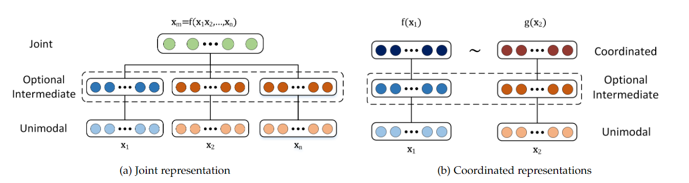
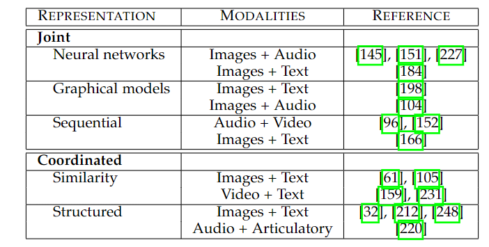
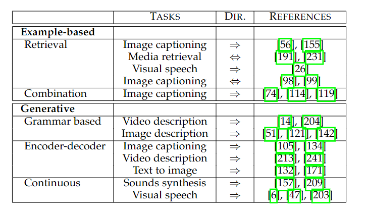
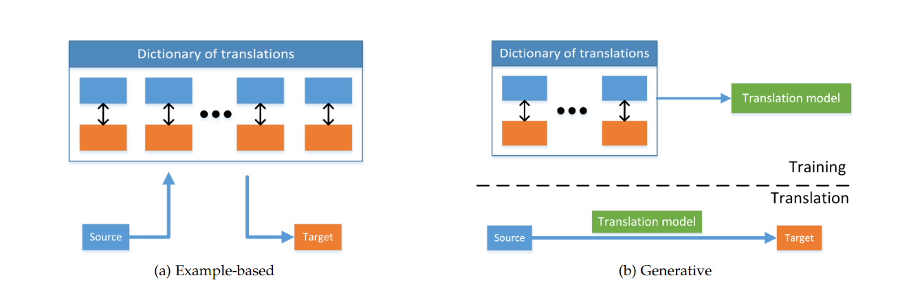
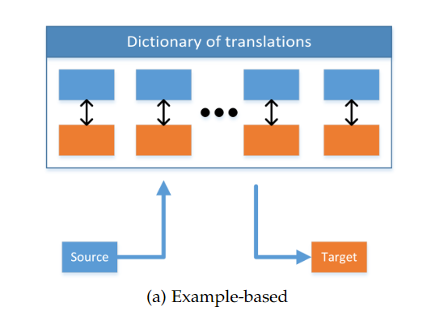
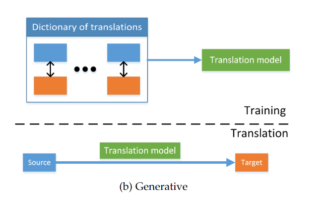
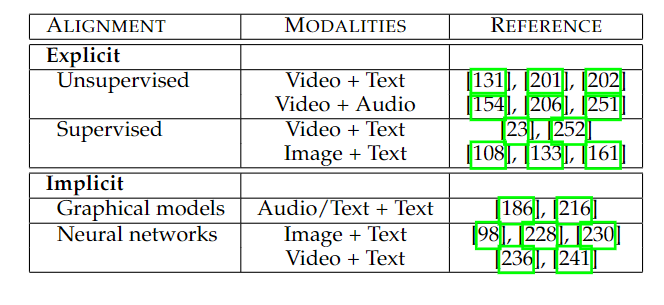
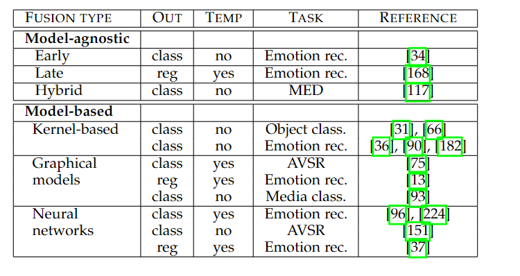
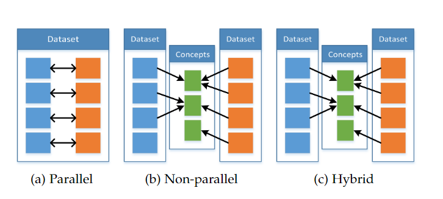
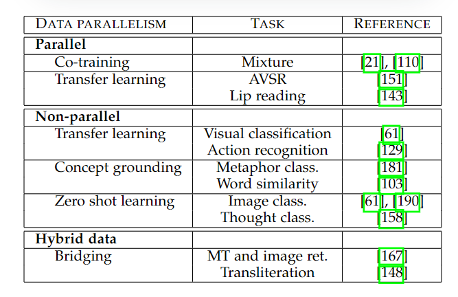

- [多模态机器学习综述和分类](#多模态机器学习综述和分类)
  - [Introduction](#introduction)
  - [Application](#application)
    - [AVSR](#avsr)
    - [Multimedia context indexing and retrieval](#multimedia-context-indexing-and-retrieval)
    - [Understand human multimodal behaviors](#understand-human-multimodal-behaviors)
    - [media description](#media-description)
  - [Representations 多模态表示](#representations-多模态表示)
    - [Joint Representations](#joint-representations)
      - [Neural Networks 神经网络](#neural-networks-神经网络)
      - [Probabilistic graphical models 概率图模型](#probabilistic-graphical-models-概率图模型)
      - [Sequential Representation 空间表示](#sequential-representation-空间表示)
    - [Coordinated Representations](#coordinated-representations)
      - [Similarity](#similarity)
      - [Structured](#structured)
    - [discuss](#discuss)
  - [Translation](#translation)
    - [Example-based](#example-based)
      - [Retrieval-based models](#retrieval-based-models)
      - [Combination-based models](#combination-based-models)
      - [discuss](#discuss-1)
    - [Generative](#generative)
      - [grammar-based models](#grammar-based-models)
      - [encoder-decoder models](#encoder-decoder-models)
      - [continuous generation models](#continuous-generation-models)
    - [model evaluation and discussion](#model-evaluation-and-discussion)
  - [Alignment](#alignment)
    - [Explicit Alignment](#explicit-alignment)
      - [Unsupervised](#unsupervised)
      - [Supervised](#supervised)
    - [Implicit Alignment](#implicit-alignment)
      - [Graphical Model](#graphical-model)
      - [Neural Networks](#neural-networks)
    - [discussion](#discussion)
  - [Fusion](#fusion)
    - [Model-agnostic approaches](#model-agnostic-approaches)
    - [Model-based approaches](#model-based-approaches)
    - [discussion](#discussion-1)
  - [Co-Learning](#co-learning)
    - [parallel data](#parallel-data)
    - [non-parallel data](#non-parallel-data)
    - [hybrid data](#hybrid-data)
# 多模态机器学习综述和分类
多模态机器学习旨在构建可以处理和关联来自多个模态信息的模型  

## Introduction
大多数人将模态这个词与感官情态联系在一起，代表我们交流和感觉的主要渠道，如视觉或触觉。  
一个研究问题或者数据集当包含了多个模态时，就称之为多模态。  
**本文研究三个模态：自然语言(可以被写也可以被说)，视觉信号(经常被表示为图像或者视频)，音频信号(对声音和例如音色，音量的副语言进行编码)。**  
**人工智能技术需要能够对多模态信息进行解释和推理，多模态机器学习旨在建立一个能够处理和关联多种模态信息的模型**。
多模态机器学习主要包含以下几个挑战：
1. Representation表示。一个基本的挑战是学习如何利用多种模态的互补性和冗余性，来进行表示和总结多模态数据。这种多模态的异质性，使得构建其总体表示比较困难，如文字通常是具象的，而音频和视觉往往是编码为信号。
2. Translation转换。第二个难点是如何将数据从一个模态映射到另一个模态。多模态间不仅有异构性，他们之间也是主观的或者开放的。例如，一个图像可以有多种方法来描述，而对于文字的翻译，没有任何一个标准答案。
3. Alignment对齐。第三个挑战是如何从两种或多种模态中识别不同要素之间的直接关系。例如我们希望在视频播放过程中，一道菜的制作过程的图像和对制作过程进行描述的文字是对齐的。为了解决这个问题，我们需要衡量不同模式间的相似性，并处理可能的长期依赖性和模糊性。
4. Fusion融合。第四个挑战是如何将两个或多个模态进行融合，去进行预测任务。例如，在一个音频与图像融合的语义识别任务中，嘴唇运动的图像信息可以和语音信号进行融合，去得到文字。从多种模态而来的信息，会有不同的预测强度(predictive power)和噪声拓扑(noise topology)，还有可能在某一模态上有数据丢失。
5. Co-learning共同学习。第五个挑战是如何在多个模态间，多个模态的表示间，多个模态的模型间进行信息传递。协同训练，概念基础和零样本学习就是一个例子。Co-learning探索一种如何从一个模态的数据中去影响一个由多个模态信息融合的模型。当其中一种模态的资源有限时，这一挑战尤其重要。

## Application
### AVSR
最早兴起的多模态研究是audio-visual speech recognition(AVSR) 音频视觉融合的语义识别任务。  
AVSR任务受到麦格克效应的启发，该效应是一种在听觉和视觉上交互的现象，说话人的嘴唇动作能够影响听的人的理解。  
AVSR的最初目标是提高语义识别的性能，如降低错误率等，但是它们得到了一个更有趣的发现，即视觉信号融合进去之后的优势是当音频信号噪声比较高时，视觉信息能够进行纠正。  
换句话说，多模态信息间的交互，不是互补的(complementary) 而是补充的(supplementary)  
解释而言，就是说音频和图像都捕获了相同的信息，这样在一方有缺失的时候，能保证多模态模型的效果，提高了鲁棒性，但是！**在无噪声场中，即音频信息没有缺失时，融合了图像信息后，模型效果没有提升**，这就说明了其不是互补的而是补充的。  
### Multimedia context indexing and retrieval
多媒体内容索引和检索任务是多模态的第二个重要方向。  
当做多媒体内容的索引和检索任务时，融合多个模态是很自然也很必要的。衍生出了如自动镜头边界检测和视频摘要等研究。  
### Understand human multimodal behaviors
在多模态交互的第三个研究方向是研究是在社交活动中，理解人类的多模态行为。  
一个具有里程碑意义的数据集是AMI会议语料库，其中有超过100多个小时的会议视频纪录，都经过转录和注释。  
另一个重要的数据集是SEMAINE语料库，可以研究说话者和听者之间的动态关系。  
情绪识别和情感计算也是多模态方向的重要研究内容。
### media description
最近兴起了一种融合文字和图像的多模态应用：媒体描述(media description)  
最具代表性的应用是图像字幕功能，给定一张图像，生成对应的文字描述。  
media description的一大难点在于如何对模型效果进行评估  

## Representations 多模态表示
多模态表示是使用数据进行一个模态实体信息的表示。  
多模态信息表示的难在在于：如何将异构源的多种数据进行组合？如何解决多种维度的噪声？如何处理缺失数据？  
一个好的表示需要考虑很多属性：**平滑度、时空相干性、稀疏性和自然聚类性质**。  
同时在多模态场景里，一个好的属性表示还需要考虑：如何评估不同模态的相似性，换句话说，**就是模态的表征在其他模态缺失时，也应该容易获得；或者可以根据观察到的模态，填充缺失模态。**  
随着ML的发展，单个模态的数据表征方法也在不断变化，已经取得了很大的成功。  
举例而言：
1. 在图像领域 SIFT 尺度不变特征变换是之前处理图像的常用方法，而当前往往使用CNN卷积神经网络进行特征提取
2. 在音频领域 MFCC 梅尔频谱倒谱系数是过往常用的处理音频的方法，而当前已经被神经网络逐渐替代，如语义识别任务中使用深度神经网络，副语言分析任务中使用循环神经网络进行表示。
3. 在文本领域 过往使用n-gram tf-idf类似基于频率的方法，目前已经被数据驱动的word-embedding

单模态信息的表示已经十分成功，但是如何进行融合，并不是十分容易。  
**对于多个模态的数据间的关系，主要有两个方面：joint coordinated 联合和协调**  
Joint联合，表示将单模态信号这组合到相同的空间表示中  
Coordinated协调，表示分别处理单模态信号，但对它们施加某些相似性约束，将多模态数据整合到所谓的协调域coordinated space中去  
  
Joint表示是将所有模态作为输入，生成各自的中间表示，最终映射到同一个空间中。即xm = f(x1, x2,... xn) x1, x2... xn是各个多模态处理的中间信息，f是一种映射 可以是deep NN可以是RNN等  
Coordinated是将各个模态作为输入，生成各自的中间表示后，最终扔存在于各自的空间中，但是要通过相似性或结构约束进行协调。即f(x1) ~ g(x2)，每个模态有对应的函数如f和g，虽然多个模态间是独立的，但是各自产生的空间是协调的以波浪号进行表示，这种协调的例子如：最小化余弦距离、最大化相关性以及在结果空间进行执行偏序等  
Joint和Coordinated的表示方法和形式如图所示：  
  
### Joint Representations
Joint表示方法是当多模态数据同时被训练和推理的情况下，使用最多的表示方法。  
最简单的joint方法就是单个模态特征的串联，也被称为早期融合。  
接下来讨论三个更高级的方法：**神经网络、概率图模型和循环神经网络**  
#### Neural Networks 神经网络
神经网络本身是单模态数据表示最为流行的方法，他们用于表示视觉、听觉和文本数据。  
为了让一个神经网络能够表征数据，一般而言需要通过一个特定任务进行预训练(如图像领域的物体识别任务)，通常用倒数第一或倒数第二层隐层表征单模态数据。  
**为了使用神经网络进行多模态任务，每个模态都使用网络进行表征后，通过一个隐层映射到同一个空间中，之后就可以通过多个隐层或者直接用来进行预测。**  
**这种方式很明显，在单模态的表征网络和多模态融合网络间是有很密切的关系的。**  
一般单模态的特征网络，通常使用auto-encoder或者无监督的数据进行学习  
有学者采用auto-encoder的思想进行多模态任务：通过堆叠的denosing-auto-encoder进行各个单模态信息的表征，最后通过另一个auto-encoder进行模态融合。  
一些有带标签数据的fine-tune形式也是常用的。  
**优点：**  
1. 其通过无监督学习所训练出的pre-train model非常强大，用以表征单模态时非常好用  
2. 容易实现
**缺点：**  
1. 模型效果很大程度上取决于可以使用的有监督样本量
2. 难以处理缺省数据
3. 不一定能把model train好

#### Probabilistic graphical models 概率图模型
概率图模型通过使用潜在随机变量构建表示方法。其可以表示单模态数据也可以表示多模态数据。  
最为流行的图模型表示是深度玻尔兹曼机(DBM) 将受限玻尔兹曼机(RBM)作为块进行堆叠。  
概率图模型的一大优势是其不需要有标注的数据进行训练，因为其是图模型，数据的表示是概率性的。  

#### Sequential Representation 空间表示
三种模态，文字、视频和音频流，往往不是固定长度的数据，一般是变长的序列。  
RNN类的模型，在诸如文字、音频和图像的单模态序列上取得了很大的成功  
同时，RNN类的模型也可以将多种模态进行融合。  

### Coordinated Representations
Joint方法是将多个模态映射到一个空间内，而Coordinated的方法则是将各个模态独自进行表示，同时通过一个约束来协调他们。  
一般Coordinated的方法有两种：Similarity不同表示间的相似性，Structured在生成的空间上增强结构  

#### Similarity
Similarity模型将在协调空间中，将各个模态的距离最小化。  
举例而言，相似度模型希望能够将文字"dog"和狗的图片的表示之间的距离比文字"dog"和车的图片的表示之间的距离更小，即相关性更高的两个模态的向量间，距离应该更小。  
神经网络是一种构建协调表示比较流行的方法，因为网络可以端到端的方式进行处理。  

#### Structured
Structured coordinated space models的方法在模态表示之间施加了额外的约束，这种约束是针对于不同应用所特制的，对哈希 跨模态检索和图像字幕有不同的处理方法。  
跨模态哈希是进行结构化融合的方法之一，将高维数据压缩成紧凑的二进制代码，对具有相似性质的多模态数据使用相似的hash编码进行处理。  
另一种多模态结构化融合的样例是图像和文字的order-embedding。  
一种特例是基于典型相关分析CCA的结构化协调，CCA计算线性投影，最大化两个随机变量之间的相关性。  

### discuss
有两种多模态表示的范式：Joint and Coordinate 联合和协调。  
Joint表示将多模态数据映射到一个公共空间中，同时在推理期间所有模态都存在。  
Coordinated表示将每个模态投射到一个单独的空间中，但有一定的协调约束；其在测试时，可以仅使用一个模态进行处理。  
Joint的方法已经被用在两种及以上的模态融合中，而Coordinated的方法仅用在双模态场景。  

## Translation
多模态机器学习中很重要的一部分是如何从一个模态转化(translating / mapping)为另一个模态，即给定一个模态的信息作为输入，输出是另一个模态中相同实体的表示。  
举例而言，给定一个图像，输入一个图像的描述；给定一个文本描述，生成与之匹配的图像。  
随着NLP和CV的发展，以及多模态数据集的出现，模态转换领域开始受到重视，最主要的一个领域是图像\视频字幕生成任务。这类任务中，不仅需要强大的图像模型，还需要语言模型进行生成  
可以将模态转化任务分成两种：example-based基于样例的模态转换和generative生成式的模态转换  
example-based方法在进行模态转换时，是根据一个字典进行处理；generative方法构建一个能够直接转换的模型  
  
生成式的模型更具有挑战，因为它们需要具有生成讯号或者符号的能力，这对于任何视觉、听觉或者文字来说，都是非常难的，尤其是需要生成时间和结构一致的序列时  
但是随着ML的发展，生成式的模型也在不断发展。  
  
### Example-based
example-based的算法受到训练数据的限制，这个训练数据就是字典dictionary  
  
可以看到example-based是从dictionary中去选择或者索引最佳的转换形式  
可以将example-based的方法分为：基于检索retrieval的 / 基于组合combination的  
基于检索的直接在字典中进行索引，不需要任何修改  
基于组合的模型依赖于更复杂的规则来基于多个检索的结果，得到最终的模态转换。  
#### Retrieval-based models
基于检索的模态转换模型时最简单的形式，只需要通过在字典中寻找与样本最接近的作为结果即可，**检索可以在单模态空间中也可以在多模态空间中进行**。  
例如：视觉语音合成任务或者text-to-speech任务中，通过检输入语音的信息，在图库中检索对应最为匹配的视觉信息；  
另一种方法是在检索过程中，使用**中间语义空间进行相似性比较**。  
例如：将图像和文字都映射到一个<物体，动作，场景>的三元空间中，然后在该空间中进行转换。或者使用深度神经网络进行直接计算相似性  
**在语义空间中的检索方法往往比单模态检索的方法好，因为他们在更有意义的空间进行检索，而且，它们允许双向转换。但是他们需要手动构建语义空间或者依赖于大量数据集训练。**  

#### Combination-based models
combination-based方法不从字典中检索结果，而是以一种有意义的方式，构建更好的模态转换  
例如：首先寻找到和输入图像具有相似描述的多个额外图像，综合多个图像，得到对该类图像的合适描述。  

#### discuss
example-based的方法很好理解，但是问题是其需要一个字典，使得模型很大而且推理速度很慢，而且有些字典甚至是无法构建的  
同时有一些字典并不是双向的，只能将特定模态转化为另一个特定模态，无法反向转化。  

### Generative
生成性的模态转换模型是一个能够在给定单模态源输入的表示后，进行多模态生成。  
这是很具有挑战的，因为它需要理解源模态和生成模态的序列或信号，才能完成。  
  
文字的生成和语音的生成探索工作比较多，真实图像生成的探索目前比较少，能处在早期阶段  
可以将生成目标模态的形式划分为三类：基于语法的grammar-based、encoder-decoder、continuous generation连续生成模型  
grammar-based限制生成目标来简化任务，如基于<主语、谓语、宾语>的模式进行生成  
encoder-decoder先通过encoder将源模态编码为特征向量，之后使用decoder进行目标模态生成  
continuous generation基于源模态的输入流，进行动态生成目标模态，在最合适的时间维度上进行转换，如text-to-speech  

#### grammar-based models
grammar-based的模型依赖于预定义的语法grammar进行模态生成。首先从源模态中检测内容，如图像中的任务对象或者视频中的动作；之后将这些检测到的内容套入到预定义的模式中，以生成目标模态  
例如：给定一个视频，通过处理视频后，套入一个who did what to whom and where and how they did it的grammar结构中去，或者使用<主语、谓语、宾语>进行生成  
grammar-based的方法的优点是 当他们使用预定的模板和受限的语法时，更有可能在目标模态上生成正确的结果  
但是这只是一种生产公式，而非创造性的转换；对于各个模态的转换，需要很多有标注的单独模型和单独数据集进行处理  

#### encoder-decoder models
首先将源模态编码为向量表示，然后使用decoder进行目标模态生成，所有的都在一个单通道中完成。  
encoder-decoder自机器翻译任务而来，目前已经成功用于图像字幕、视频描述、音频生成的任务中  
encoder部分中，将音频信号编码的方法包括RNN和DBN等，大部分文字的编码使用分布语义或者RNN，图像的编码使用CNN  
**值得注意的是，单模态的独立表示已经很强大，但是，使用第三章中的coordinated的方法进行表示，能够得到更好的结果。**  
decoder通常使用encoder的hidden state进行初始化，同时往往伴有注意力机制  
而在图像方面，RNN结果依然比较一般，基于GAN的方面已经有很大进展。  
有些人任务encoder-decoder模式是在记忆训练数据，而非学习并理解数据；此外此模式需要大量数据进行训练  

#### continuous generation models
连续生成模型的理念在于以在线的方式在每个时间步都产生输出，这种方式在seq2seq如text-to-speech speech-to-text video-to-text的模式中很有用  
encoder-decoder和grammar-based的方法，都是将整个时间维度的数据作为输入去进行生成；连续生成模型要不断地进行生成  
该方法主要要解决模态之间时间一致性的要求  
一般在speech-to-text和text-to-speech中用的比较多，给定一部分文字就可以输出音频，给定一部分音频就可以输出文字  

### model evaluation and discussion
多模态转换方法面临的重要挑战是效果难以评估，虽然语义识别等任务的输出是唯一的，但是大部分任务，都没有所谓的正确答案，如语音合成或媒体描述任务等  
通常，评价模态转换效果最直接的就是使用人类主观判断的方法。  
直接对语音合成的自然度、视觉语音合成的真实性，媒体信息描述的语法语义正确性等进行评价。  
或者可以让人类主观地进行偏好选择，将两种转换呈现出来，进行比较  
人工评价的方法虽然最接近人类判断，但是又耗时又昂贵，同时还需要找到不同类型的志愿者进行评价  
同时也有一些自动地评价标准，如BLEU等  
对于一些任务，还可以用检索的方式进行评价，如图像字幕场景中，根据文字和图像的匹配度进行排名。  
类似于Visual QA任务中，会有一些正确答案，也比较容易评价  

## Alignment
多模态alignment对齐的定义为从两个或多个模态中找到sub-components之间的关系和对应性  
例如：给定一张图片和一个标题，要找到图片中对应标题的部分；或者找到标题中描述图片的部分  
另一个例子是给定一个电影，将其与它所基于的剧本或书籍章节对应  
对齐可以分为两种：implicit隐式对齐和explicit显示对齐  
在显示对齐中，就是在多个模态间的sub-components进行对齐 例如：对做菜的文字描述和教学视频进行对齐  
隐式对齐被用在另一个任务的中间步骤 例如基于文本描述的视频检索可以包括文本和图像区域的对齐步骤  
  

### Explicit Alignment
显示对齐的目标是将来自两个或多个模态的实例进行配对，那么就是显示对齐。  
大多数的方法依赖于来自不同模态中实例的相似度进行构建；这些相似度可以手动定义，也可以通过学习来定义。  
显示对齐的方法可以分为两种：无监督unsupervised和有监督(弱监督)(weakly)supervised  
#### Unsupervised
无监督的多模态对齐方法在无需任何直接的对应label即可进行对齐  
大多数无监督的灵感来源于机器翻译或基因组序列对齐的理念。很多方法设计了一些约束，如**序列的时序性质或模态间存在相似度度量**  
具体样例主要有DTW(动态时间规整)和图模型，它们都对alignment加入了一定得限制，如时间一致性、时间上没有大的跃迁或者专家知识等。  
#### Supervised
有监督的多模态对齐方法依赖于有标签的对齐实例数据，通过它们去训练模态间的相似度。  
主要方法大致分为图模型和深度神经网络两个方面。  

### Implicit Alignment
隐式对齐方法被用来另一个任务的中间步骤，这些模型不会显式对齐数据，也不依赖于有监督的数据对，它们是在模型训练过程中潜在地对齐数据。  
主要可以分为：图模型和神经网络两种  

#### Graphical Model
有一些早期的图模型的工作用于对齐不同语言间的单词进行翻译，也有对齐不同的语音讯号和文字  
但是一般而言，都需要手动训练数据或由专业人士进行定义。  
#### Neural Networks
本质上而言，多模态转换任务(Translation)的中间过程，往往可以伴随着模态对齐的部分。  
那么在转换任务中如果使用attention机制，通过attention的分布，可以部分表征多模态对齐的特性。  

### discussion
多模态对齐任务有很多困难：
1. 具有明确标注的数据集很少
2. 难以设计模态之间的相似度计算方法
3. 可能存在多种对齐的方式；甚至并非所有模态间都一定可以互相转换

## Fusion
多模态融合是整合来自多个模态的信息以进行一个结果的预测：如分类任务(情绪分类)、回归任务(情感的积极程度量化)  
**多模态融合的三个好处：**
1. **对同一个对象的多模态观察会比单模态得到更好的预测效果；**
2. **获得同一对象的多模态表示可以捕获互补的信息，即一些在单个模态中无法得到的信息；**
3. **当一种模态缺失时，多模态系统仍然可以正常工作；**

可以将多模态融合任务分成两个方面：模型无关的model-agnostic和基于模型的model-based  
具体地，模型无关的可以分为early late hybrid 模型相关的可以分为kernel-based, graphical models, neural networks  
  
### Model-agnostic approaches
模型无关的方法可以分为早期(feature-based) 后期(decision-based) 混合三种  
早期融合是在提取特征后立即进行融合，通常通过简单连接的方式进行表示  
后期融合是在每种模式做出决定(分类或回归)任务后，进行整个。  
混合融合结合了早期融合的理念和后期融合中单模态结果的输出  

### Model-based approaches
基于模型的方法可以细分为：基于内核的方法、图模型、神经网络  
1. MKL多核学习。多核学是SVM的扩展，允许对不同的模态使用不同的核函数，因此可以构建异构数据的融合
2. 图模型。大多数图模型可以分为生成式和判别式，如隐马尔科夫模型、动态贝叶斯、条件随机场等。
3. 神经网络。神经网络往往是通过RNN类或者LSTM CNN进行多模态的融合方法

### discussion
多模态融合有很多方法，针对于神经网络的方法有几个挑战：
1. 信号在时间上可能没有对齐；
2. 很难建立同时利用互补信息的模型；
3. 每个模态有不同的噪声情况

## Co-Learning
多模态任务的最后一个挑战是co-learning 通过利用来自一个具有丰富内容模态的知识，来帮助一个具有比较稀少信息的模态进行建模；  
而当其中一个模态优先：缺失数据，noisy的输入，不可靠的label时，co-learning尤其重要。  
co-learning中helper模态往往仅存在于训练期间，在测试期间并不使用  
总体而言，可以将co-learning划分为：parallel-data, non-parallel data,和hybrid data三种  
  
  
### parallel data
parallel-data需要训练数据，训练数据中，一个模态和另一个模态的信息直接相关；换句话来说，多模态信息来自同一实例，即视频和语音来自同一个说话人  
又可以将其分类为co-training协同训练和representation learning表征学习  
1. 协同训练co-training是在有标记样本很少时创建更多有标记的数据的过程，基本方式是在每种模态间构建弱分类器，使用未标记数据的标签相互引导。
2. 迁移学习transfer learning 通过一个模态迁移到另一个模态

### non-parallel data
non-parallel data不需要多模态间的信息具有直接联系，这些方法通常使用类别重叠来实现共同学习。  
1. 迁移学习可以在non-parallel data上进行，允许通过将信息从干净模态构建迁移，转化为稀缺的莫台上
2. Conceptual grounding 指的是学习语义含义或概念，不仅基于语言，还基于视觉、声音甚至气味
3. 零样本学习 零样本学习通过从未见过的样本进行处理 主要获得单模态的具体组成和属性或者多模态的其他对象

### hybrid data
混合数据通过共享模态或数据集进行桥接 主要有Bridge Correlational Neural Network  