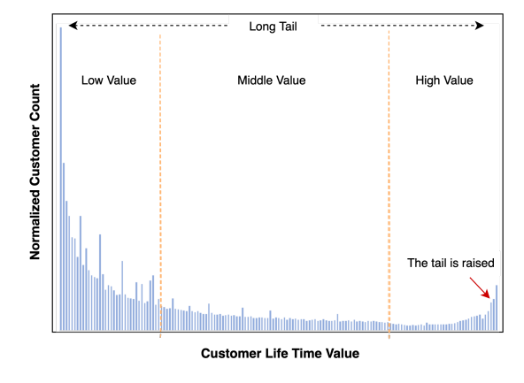
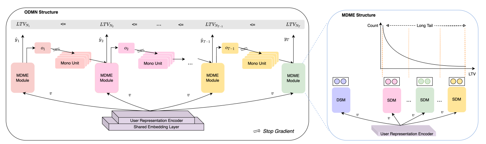
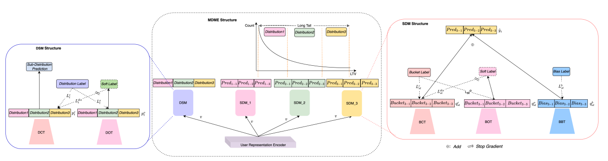

# Billion-user Customer Lifetime Value Prediction: An Industrial-scale Solution from Kuaishou
文章的思路是使用分治法将长尾分布进行桶分割，而后进行桶内回归计算。  

LTV(Customer Life Time Value)指的是对于公司而言，在用户一段时间的生命周期内，从所有的互动能够获得的价值。若能够较为准确地对用户LTV进行预测，则能够针对特定用户的LTV去做出特定的决策，例如对用户投入的优惠程度、推荐力度等都可以根据预测的LTV进行进一步优化。  
LTV往往是一个长尾分布，在快手场景中如下图所示：  
  
在真实世界中，用户价值往往是一个长尾分布，即价值非常非常低的用户占绝大多数、而在价值居中的用户往往是一个正常分布，最后价值很高的用户在很多情况下也会存在一个小的聚集性。  
对于长尾分布而言，往往存在以下三种处理方法：
1. 类别均衡法 Class Re-Balancing。可以使用重采样、降采样等方法将正负样本均衡化，使得各个部分数据更为均衡；另外可以对少样本加以更高的权重、样本多的加以更低的权重；
2. 信息增强法 Information Augmentation。可以采用例如迁移学习、知识蒸馏、预训练微调等策略进行处理。另外可以进行数据增强以让样本进行均衡。
3. 模型优化 Module Improvement。在模型设计层面进行优化，处理长尾问题。

## 算法
### 输入用户特征处理
LTV预测任务的输入是用户的各种信息，例如用户的基本信息、用户一段时间的行为信息等。具体地：
1. 不考虑过度私人化的数据，如user_id, item_id等信息；
2. 考虑周期性、季节性和异常性的信息；
3. 考虑用户来源的渠道；
4. 考虑用户消费的时间、频率和数值等信息。

对于后续所有的任务而言，对上述输入用户特征进行embedding，对于数值型特征可以直接处理，对于类别型数据可以使用Embedding方法处理等等。后续所有的任务都是在输入embedding后的特征上进行处理，所以称之为Shared Embedding Layer；embedding之后将各个特征拼接起来，称之为User Representation Encoder。  

### MDME模块
模型结构图：  
  
  
思路：
1. 分治法将其分割为多个子分布，分割方法使得每个分布中尽可能稳定可预测，这样每个样本仅属于一个子分布；
2. 第二阶段再用分治法将子分布分割为多个桶，每个样本仅属于且仅数据一个桶；
3. 每个桶是一个区间[left_boundary, right_boundary]，每个样本都有一个偏移值α [0,1]，那么具体的LTV数值就是left_boundary+α*(right_boundary-left_boundary)；

算法实现：
1. DSM模块用来预测样本在哪个子分布中，其中DCT模块是一个分类器，分类头个数为子分布的个数，DOT模块制造soft label进一步指导DCT模块的预测；
2. 每个子分布都对应一个SDM模块，其中BCT模块是一个分类器，分类头个数为当前子分布所分割的桶的个数，BOT模块制造soft label进一步指导BCT模块的预测，BBT模块是一个回归器，预测桶内偏移值α；
3. 对于多个LTV预测时间点而言，MDME的结构完全相同，但是实际上不同的时间点之间的LTV值存在相关关系，即LTV(t) <= LTV(t+1)，时间越久的话用户价值越高，使用Mono Unit模块在预测时间之间进行信息传递

损失函数：
1. DCT模块的softmax子分布分类交叉熵损失；
2. DOT模块的N个二分类交叉熵损失，在真实分布前面的分布true label为1，真实分布及之后的true label为0，作为独立的N个二分类任务，进行交叉熵计算；
3. DOT-DCT的蒸馏交叉熵函数，由DOT产生的soft label作为true label，与DCT的logits计算交叉熵；
4. BCT模块的softmax桶分类交叉熵损失；
5. BOT模块的M个二分类交叉熵损失，在真实分布前面的分布true label为1，真实分布及之后的true label为0，作为独立的N个二分类任务，进行交叉熵计算；
6. BCT-BOT的蒸馏交叉熵函数，由BOT产生的soft label作为true label，与BCT的logits计算交叉熵；
7. BBT模块的回归值与真实的偏移值计算MSE损失；
8. LTV(t)与LTV(t+1)之间的差值应该小于等于0，但是大于0的话会产生惩罚作为损失。

复现技巧：
1. DCT和DOT的交叉熵计算直接可以计算；
2. 由于同个batch中的不同样本往往对应不同的分布，选择对应的SDM很难以整体以batch操作；处理方法是使用[处理技巧](https://github.com/MMMMysticY/tensorflow_study/blob/master/tensorflow1/%E5%B8%B8%E7%94%A8%E6%8A%80%E5%B7%A7.md)中实现的方法，所有的分布都计算结果，最后用one-hot处理计算结果值；
3. 在每个分布中，BCT、BOT交叉熵可以直接计算；
4. BBT的MSE计算时不同的batch的不同样本往往对应不同的桶，难以直接选择左右边界，这样处理技巧和上述一样，所有桶都计算结果，最后用One-hot计算最后的结果值。
5. 在最后的第八项损失函数中，计算出对应的LTV后进行减法即可