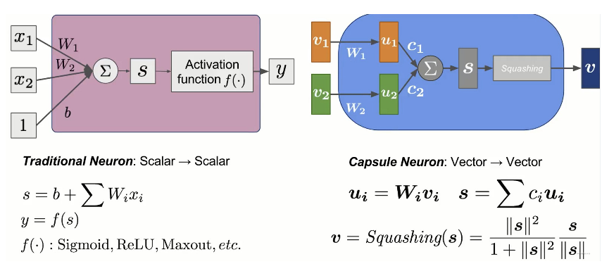
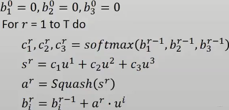
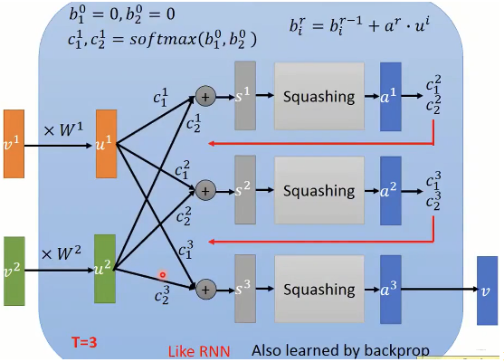
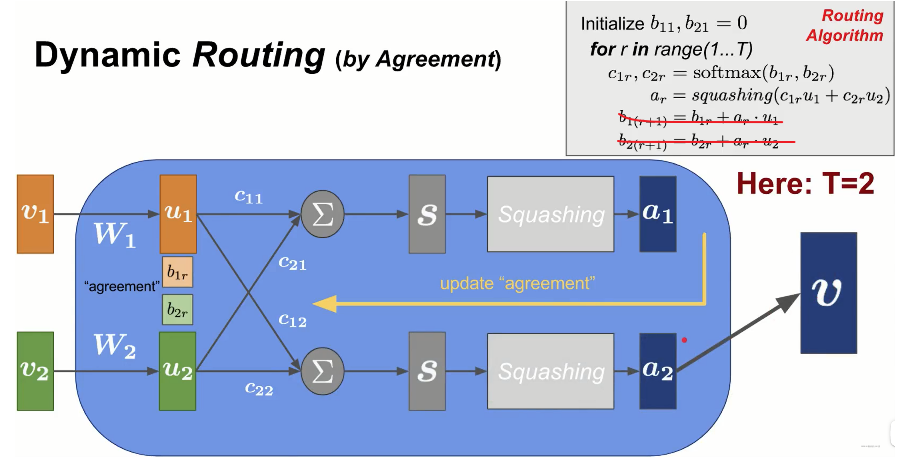
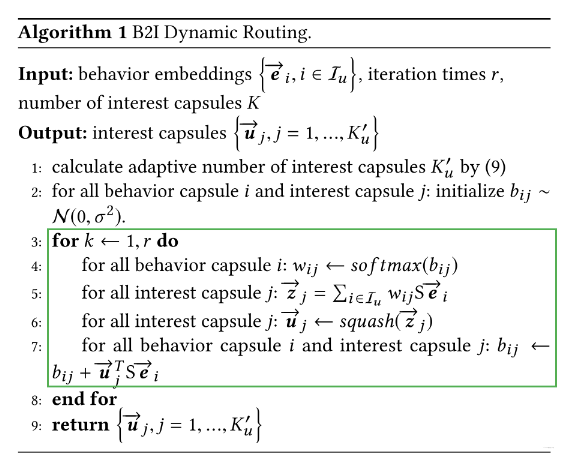
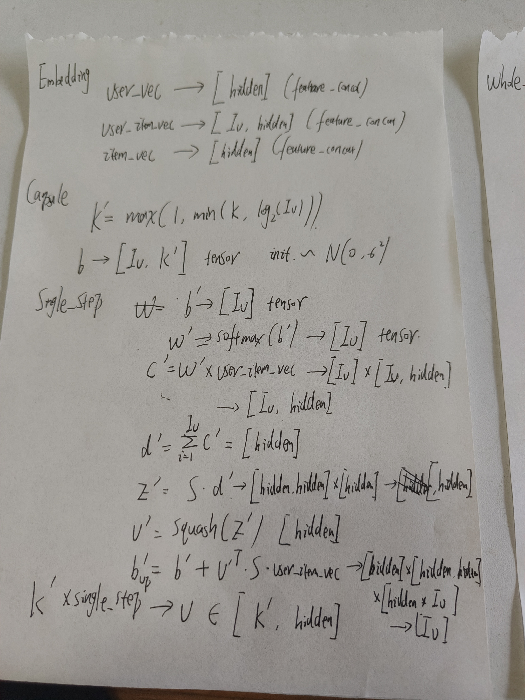
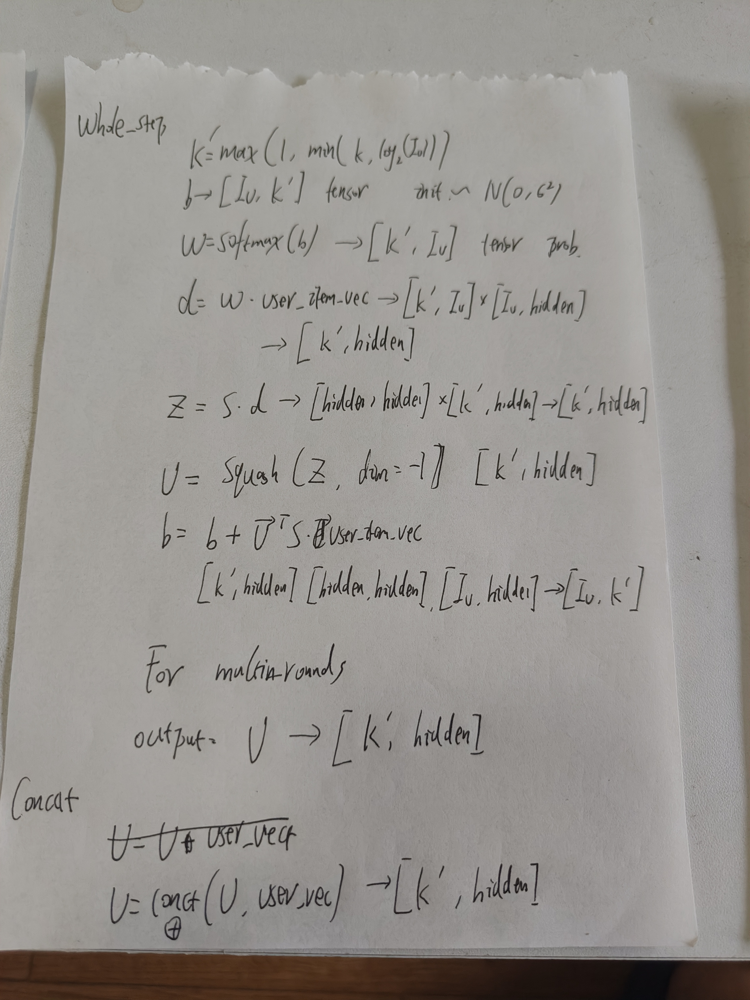
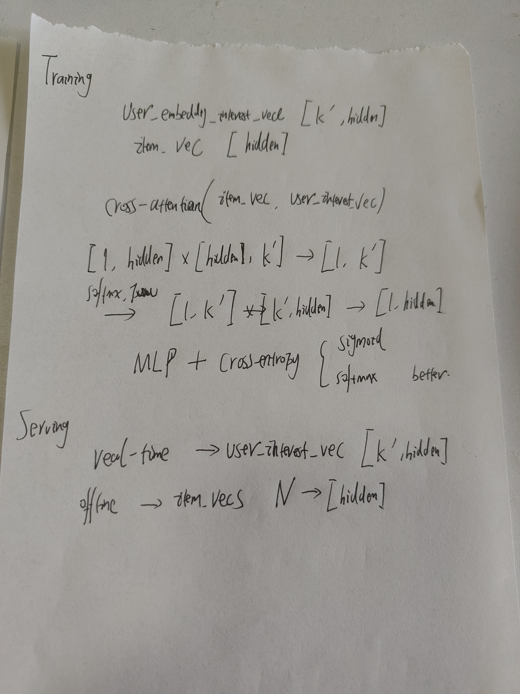
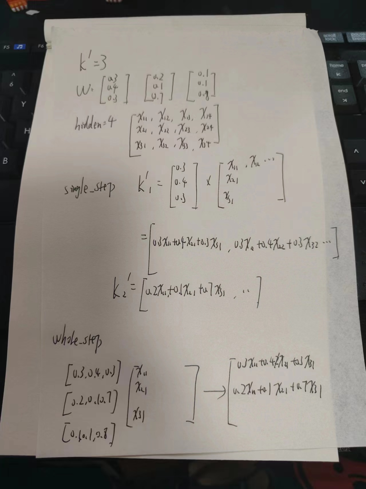

# Mind
## 基本理念
Mind是一个召回层的模型，其基本理念是：使用**动态路由算法**将用户过去的历史商品聚成多个集合，每个集合进一步推断为用户特定的兴趣；这样，对于一个特定的用户，模型根据其过往交互过的商品得到多个向量表示，代表不同的兴趣；当用户有新的交互时，通过**胶囊网络**，实时改变用户的兴趣表示向量，做到在召回阶段的实时个性化。  
由于Mind是一个召回层模型，其模型规模不能过大；另外，其大体结构仍为双塔，user塔和item塔，这样item塔可以在离线进行o2o计算存储，实时推理时仅需要进行user塔的计算；  
Mind的核心是动态路由算法和胶囊网络。
## 胶囊网络
如果将胶囊网络对比普通的神经网络，那么神经网络可以称之为value to value的形式，即输入是一个标量，经过神经网络和激活函数，输出也为标量；胶囊网络则为vector to vector的形式，输入为向量，输出也为向量。  
  
1. 普通神经元。我们往往说模型输入input_tensor [batch, hidden]，本质上可以理解为就是hidden个数字进入网络，如果网络是一个神经元的话，就是[batch, hidden] * [hidden, 1] -> [batch, 1]，之后经过激活函数，得到一个标量数字（很主观地可以感觉到，激活函数都是对于标量数字的处理）；  
2. 胶囊网络。在胶囊网络中，输入为N个tensor，每个tensor的维度是[hidden]，而后关键的是，对于每个tensor而言，与其相乘的W仅为线性映射，即 [hidden] X [hidden] -> [hidden]，并非矩阵乘法而是数值乘法；之后将所有的tensor加起来得到S [hidden]也为数值加法（c的计算后续再讨论）；最后没有激活函数，而是Squash方法，从起结构可以看到，第二项即为距离为1的向量，仅用来表示方向，第一项为向量的长度，是一个类sigmoid化的处理，若tensor的长度很大，则该值会接近与1，若tensor长度很小，则该值接近于0；  

胶囊网络有两点需要注意：
1. W的参数是可学习的，可以通过反向传播更新；
2. c不是可学习的，而是通过动态路由算法计算出来的
## 动态路由算法
动态路由算法是一种迭代形式的计算方式，在和胶囊网络的配合中，其往往为如下形式：  
  
1. 首先初始化b，b的个数和输入的vector个数一致；
2. 使用softmax作用在b上，计算得到c；
3. c作为权重作用在输入vector上，得到s，并之后通过squash得到结果；
4. **使用结果a和u点积，得到b的更新步长(动态路由)**

1和2是一种比较通用的做法，用softmax作为概率分布，在进行概率加权；3是上述胶囊网络的过程；这三步不用赘述；  
4是动态路由算法的核心，计算的结果向量a和各个输入向量u进行点积，得到更新步长；点积计算在tensor维度是指各个位置的数值进行相乘最终加和，这样不太好理解，把点积理解为 a·b=||a|| x ||b|| x cosθ  
**我们假定二范数都相等，那么点积的结果即与两个向量之间的夹角有关**。  
当结果向量和某个输入向量夹角接近，或者我们说向量方向相近时，其迭代步长就会更大，则下次则会额外考虑该位置的向量  
其最终迭代结果为，输入的胶囊向量会和更相关的输入向量接近。  
从另一个角度来看，很像一个聚类的过程，假定输入的多个向量分属不同的方向，那么在迭代之后，仅会留下最相关的几个输入向量，这几个被聚成了一类。  
  
从上图的结构来看，左侧的输入向量和W是较为固定的，从上到下为迭代方向，迭代过程在不断更新的是b，进而更新c最终更新到结果a上。  
## Mind
  
### 模型输入
输入包括三个部分：
1. 用户自身的特征(user_vec)；
2. 用户过往有过行为的商品特征(user_item_vec)；
3. 商品侧特征(item_vec)；
### Embedding/Pooling
就是单纯的embedding，和集团里fg结构的完全一致。  
我们假定结果为(不考虑batch_size)：
1. user_vec: [hidden]
2. user_item_vec: [seq_len, hidden]
3. item_vec: [hidden]
### Multi-Interest Extractor Layer
该层即为胶囊网络+动态路由更新结构  
假定我们只迭代两次，且只考虑单个兴趣，那么迭代结构即为：  
  
输入即为user_item_vec，输出即为用户多兴趣tensor  
但是需要注意几点：
1. 共享双向映射矩阵S，即在多个兴趣进行计算的时候，共用一个矩阵S；
2. 随机初始化b，b采样自正态分布，就像聚类时的随机初始化中心；
3. 动态兴趣数量 （待定）

伪代码：  
  
### label-aware attention
兴趣向量为[K, hidden]，item侧向量为[hidden]，那么即可将K当做一种类似attention的形式，进行计算 [1, hidden] x [hidden, K] -> [1, K]， [1, K] * [k, hidden] -> [hidden] 之后进行softmax计算  
### serving
实时推理时，item侧特征在o2o环节已经计算完毕，实时计算得到[K, hidden]后，和item侧tensor进行距离计算，后续待确定TODO

## 个人理解
    
 
    
 
    
 

### Embedding过程
1. user_vec [hidden]  
2. user_item_vec [Iu, hidden]  
3. item_vec [hidden]
### Capsule过程
K' = Max(1, min(K, log2(Iu))) K是设定的兴趣个数超参，Iu为用户交互商品个数；  
#### 单兴趣理解
若我们不考虑多兴趣，仅考虑单兴趣的情况下：
1. b'即和输入的tensor维度Iu  
2. 经过softmax计算，得到W，为加和为1的概率分布值，维度为[Iu, ]
3. c'= W' x user_item_vec，注意这里不是矩阵运算，是[Iu, ]和[Iu, hidden]进行数值广播计算，得到的tensor仍为[Iu, hidden]，即对于每个item的考虑程度，作用在tensor上；
4. d' = sum(c')，注意这里是完全的数值加和，即为reduce_sum，最终得到的tensor为[hidden]
5. 之后经过双向映射矩阵S，[hidden] * [hidden, hidden] -> [hidden] 这步是矩阵运算；
6. 最终经过squash函数，得到结果v'，[hidden] 即为挖掘的兴趣tensor
7. 最后对b'进行更新，b' = b' + v*S*user_vec_item 维度仍为[Iu, ]
如果我们将单兴趣扩散K'次，那就得到了[K', hidden]的K'个兴趣分布，扩充的过程中仅会增加b'这个可更新的部分，S是共享的不会增加，其他都一样。  
#### 多兴趣理解
1. b按照正态分布初始化，我理解为[Iu, K']维度的tensor；  
2. W=softmax(b) [k', Iu]，我们可以考虑为K'个兴趣，每个兴趣都有对输入的一个概率分布值，注意这个是会迭代更新的，所以本质上是很合适的；
3. d = W * user_item_vec  [K', Iu] * [Iu, hidden] -> [K' hidden]，这里使用矩阵相乘，合并了先进行单个数值计算  
比较笨的分析见下图：  
    

4. z = s · d  [K', hidden] * [hidden, hidden] -> [K', hidden]
5. u = squash(z, dim=-1)  [K', hidden] 在最后一维进行squash计算
6. b = b + u·S·user_item_vec  [K', hidden] * [hidden, hidden] * [Iu, hidden] -> [Iu, K']  

最终得到的结果为[K', hidden]的输出，即有K'个兴趣，每个兴趣的特征向量维度为hidden，后续我们称之为user_interest_vec
### concat/add
如果有user侧特征，进行concat或者add，最终仍得到[K' hidden]
### training
user_interest_vec [K', hidden]，item侧特征[hidden]，使用cross-attention计算得到[1, hidden]的结果，最后使用sigmoid/softmax进行计算损失。  
### serving
实时计算user_interst_vec [K', hidden]，离线o2o计算item_vec [hidden]  
在线推理后续待查