- [Look, Listen and Learn](#look-listen-and-learn)
  - [ABSTRACT](#abstract)
  - [INTRODUCTION](#introduction)
  - [Audio-visual correspondence learning](#audio-visual-correspondence-learning)
    - [Network architecture](#network-architecture)
      - [Vision subnetwork](#vision-subnetwork)
      - [audio subnetwork](#audio-subnetwork)
      - [fusion network](#fusion-network)
    - [Implementation details](#implementation-details)
  - [Result and discussion](#result-and-discussion)
    - [AVC](#avc)
    - [Audio features](#audio-features)
    - [Visual features](#visual-features)
  - [Qualitative analysis](#qualitative-analysis)
    - [Vision features](#vision-features)
    - [Audio features](#audio-features-1)
    - [Versus random features](#versus-random-features)
# Look, Listen and Learn
## ABSTRACT
在观看和听了大量无标签视频后，我们能学到些什么？或者说模型能学到什么？  
一个视频中包含了大量的信息，AVC(Audio-Visual Correspondence)音频-图像对齐任务是将一个视频中的图像和声音流进行对应  
通过训练图像网络和听觉网络，无需任何标注数据，仅仅使用原始视频，最终得到的模型在AVC任务中得到了不错的效果，而且成为了听觉和视觉的良好表示representations  
得到的两个模型，都在各自的领域得到了SOTA的效果，甚至在图像上和ImageNet分类相媲美  
最终还证明了网络能够以两种模态定位对象，同时执行细粒度的识别任务  

## INTRODUCTION
图像和音频往往一起出现，例如：手指的动作和吉他的声音往往一起出现；嘴唇的运动和声音往往一起出现；汽车的移动和引擎声往往一起出现 在这些情况下 视觉和听觉是同时感受的  
本文提出一个问题：**同时训练图像网络和音频网络**，能否去判断图像信息(视频帧)和音频信息(音频片段)是否对应？  
**这个任务，本质上比图像-音频同步任务的要求要宽松很多**  
这个任务只要判断一个图片中是否有信息和音频片段相关，即一个车的视频帧，可以和引擎声音相关，也可以和风声相关  
该工作的三个动机:  
1. 从视频中可以获得几乎无限的样本(视频可以抽帧和抽音频) 而不需要有标签的数据 这是一个完全self-supervised task
2. 这是一个婴儿在诗句和听觉发展时，会使用的资源，非常具有类似人类的感觉和可解释性；
3. 研究这种学习之后，应用在其他任务上的效果

总之：本文的目标是涉及一个系统，该系统能够通过简单地输入大量未标记的视频生成的图像和音频后，以完全无监督的方式学习视觉和音频和语义信息(semantic information)  
为了达到这一点，提出了AVC任务(audio-visual correspondence)从头开始训练两个网络(图像网络和音频网络)  

## Audio-visual correspondence learning
AVC任务的理念就是使用有价值且未被深入理解的视频，挖掘其内部所包含的信息，即图像流和音频流  
通过看到和听到很多人拉小提琴和狗吠的例子，即图像是人拉小提琴，声音可以是狗吠，反之也可以。通过大量的语料去进行实验  
这就是AVC任务  
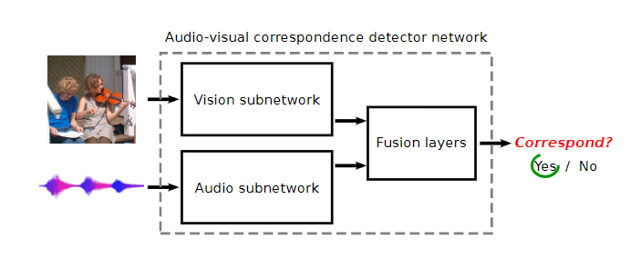  
AVC任务就是一个二分类任务，给定一个视频帧，再给定一段短的音频，二分类其是否对应  
正样本就简单地从视频的相同位置采集图像和音频即可，而负样本就从不同的视频中去采集即可  
需要指出的是，这个任务非常困难，模型需要从头开始学习视频和音频特征；同时，AVC任务是从完全无限制的视频中去学习的(视频的噪音可能很大 而音频的噪音可能会非常明显)  

### Network architecture
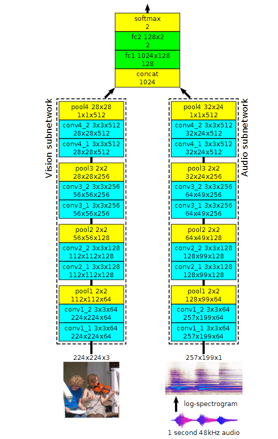
模型有三个部分：vision subnetwork, audio subnetwork(分别用来提取图像信息和音频信息), fusion network(将两种信息融合进行预测)  
#### Vision subnetwork
图像的输入是224 X 224的三通道图像，使用VGG-network类型的模型，有3 X 3的卷积核 2 X 2的最大池化 步长为2 no padding  
基本结构是conv + conv + pool 叠加四层 每层卷积之后进行batch norm和ReLu激活  
#### audio subnetwork
音频网络的输入是1s的音频，将其变为log-spectrogram 之后被处理认为是257 X 199的图像(本质是时域和频域)  
和图像的网络不通的是音频的channel是1 而图像是3  
#### fusion network
两个512的图像向量和音频向量拼接成1024维，之后经过两个全连接层进行分类，中间使用relu激活函数  

### Implementation details
1. **训练资料采样。**不相关的图像和音频，就是随机地从两个不同的视频中进行采样，随机选择一帧，随机选择一秒的音频片段；相关的图像和音频就是随机选择一个视频，随机选取一帧，之后选取包含视频帧的一段一秒的音频  
对图像采用常见的数据增强方法：随机水平翻转，亮度和饱和度抖动；音频仅通过随机将音量变化10%进行实现  
2. **log-频谱图的计算。** 采样率为48kHz的一秒音频，使用0.01秒作为区间，0.005秒作为重叠部分，那么一秒就生成了1/0.005 -1 =199个向量 每个时间片处理为257维的frequency bands 之后再取对数  
3. **训练细节。** 使用Adam优化器 16个GPU tensorflow batch=256 400k个10s的视频 60M个frame-audio pair

## Result and discussion
1. 在AVC任务上进行测试；
2. 在迁移学习的场景中，应用在图像和听觉分类任务上，衡量视觉和听觉特征提取的效果；
3. 对模型的学习效果定性分析

### AVC
对训练的模型使用AVC任务进行测试  
1. supervised baseline 对于图像网络和音频网络的baseline 是在动作分类任务上独立训练两个模型(浅层模型和L3-NET相同，后续接两层全连接层)，进行组合；之后去判断两个独立分类结果的相似性，即图像分类到一条狗，而音频分类为小提琴，那么就是不对应的；
2. supervised pre-training baseline 是从两个预训练网络中提取信息，之后拼接进行预测，注意两个feature extractor都被冻结，仅更新全连接层部分

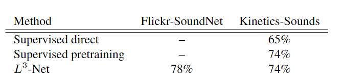  

### Audio features
衡量L3-Net audio representation的效果  
使用两个下游分类任务：ESC-50 环境声音分类任务 DCASE 场景事件音频分类检测任务  
**音频特征是通过音频子网络的最后一个卷积层(conv4_2)进行最大池化后得到的结果，最终使4 X 3 X 512 = 6144维的embedding**  
使用z-score归一化对特征预处理，训练了一个多类别的SVM进行对比  
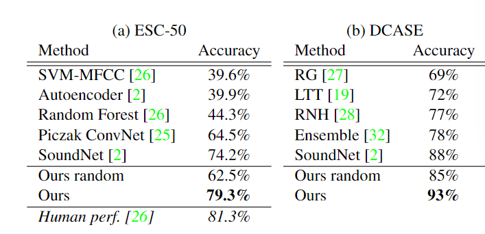  

### Visual features
衡量L3-Net visual representation的效果  
从256 X 256的图像中提取特征并在ImageNet上进行分类  
使用的是conv4_2进行最大池化后的结果 是 4 X 4 X 512 = 8192维的向量  
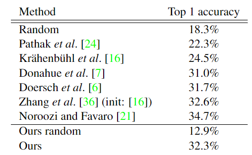  

## Qualitative analysis
定性分析网络到底学到了什么  
### Vision features
使用pool4(512维的向量)进行验证视频网络学到了什么  
对数据集中最能激活pool4中特定单元的图像进行排序，可以看到vision subnetwork学到了物体实体  
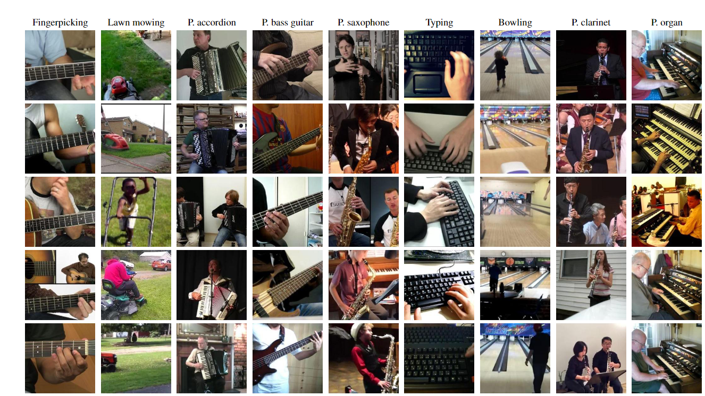  
如果看热图的话，可以看到，网络很明显地探究除了物体的位置  
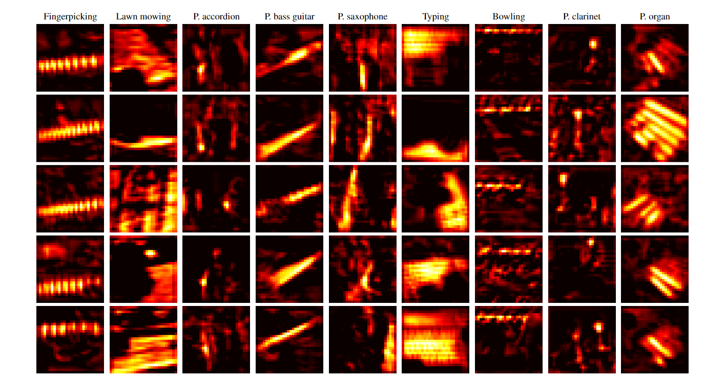  
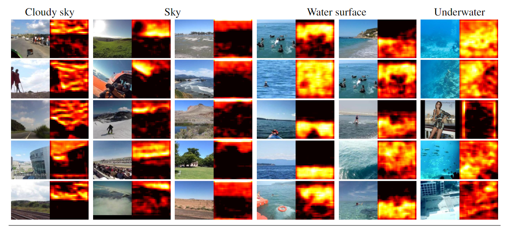  
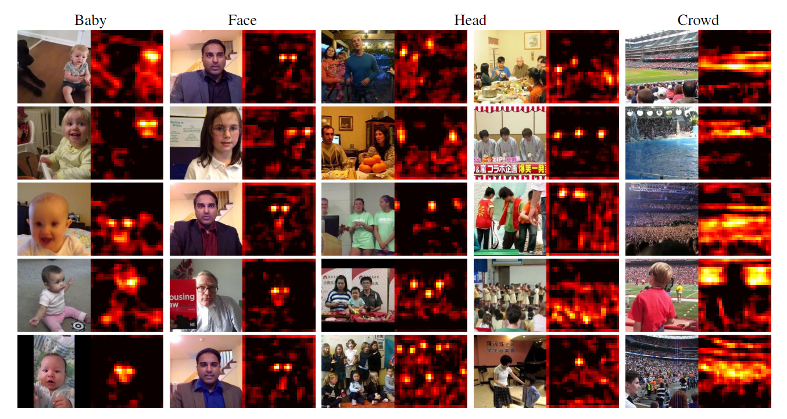  
其实可以看到，网络学习到了所谓的显著性位置  

### Audio features
出于可视化的目的，不显示waveform 而是显示和声音对应的视频帧  
可以看出其设法学习到了语义实体，即将萨克斯的音频对应到了萨克斯的图像上  
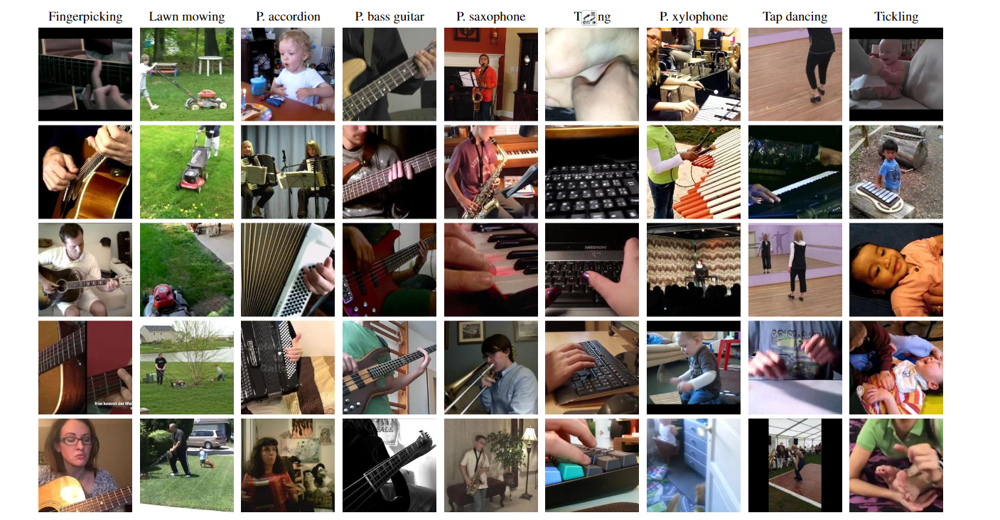  
如果显式频谱图和语义热图，可以看到L3-NET检测到了事件  
如弹吉他时得到了低频敏感的频谱图，割草机场景对宽频域比较敏感，而踢踏舞，得到了间隔性的频谱图  

### Versus random features
使用t-SNE可视化  
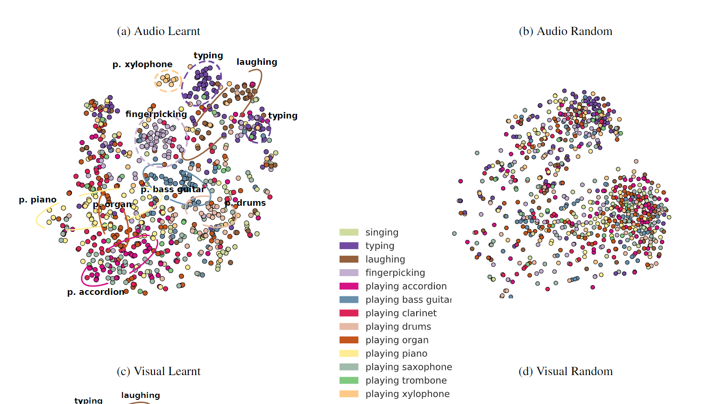  
预训练过后的embedding将相近概念的音频可以聚在一起，而随机的模型无法做到  
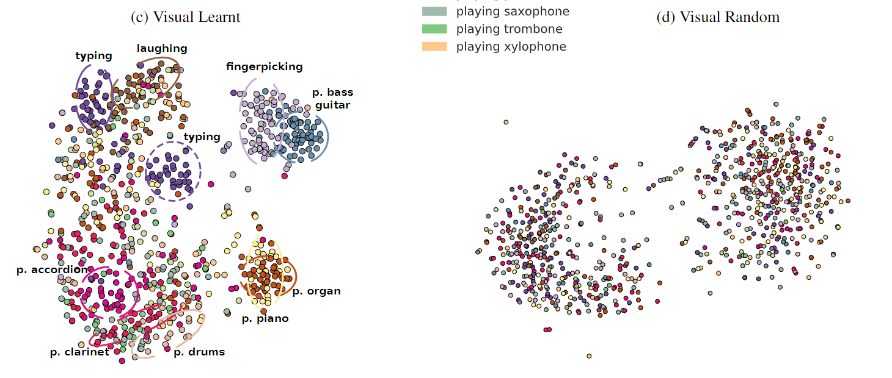  
预训练过后的embedding奖相近的图像聚类在一起，随机模型无法做到  