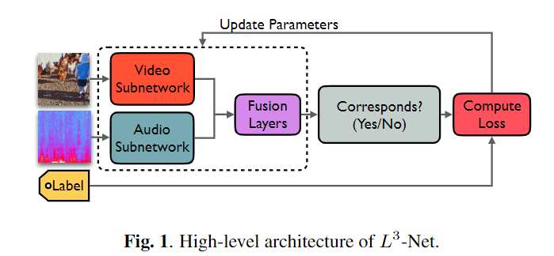
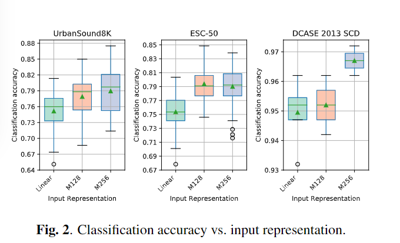
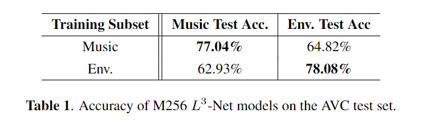
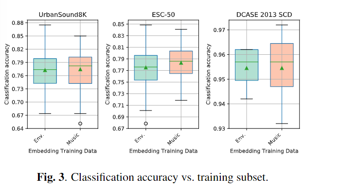
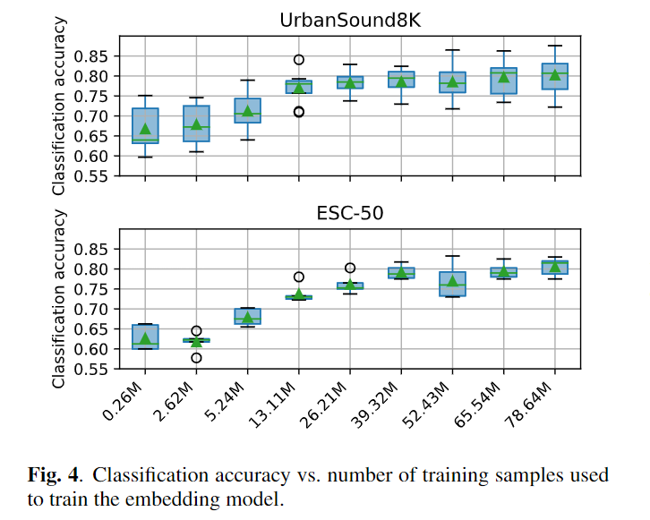
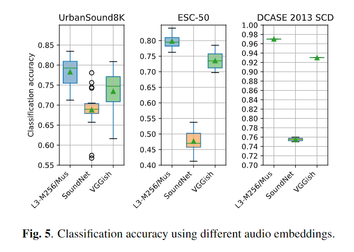

- [LOOK, LISTEN, AND LEARN MORE DESIGN CHOICES FOR DEEP AUDIO EMBEDDINGS](#look-listen-and-learn-more-design-choices-for-deep-audio-embeddings)
  - [ABSTRACT](#abstract)
  - [INTRODUCTION](#introduction)
  - [Look Listen And Learn(L3-Net)](#look-listen-and-learnl3-net)
  - [Experiment Design](#experiment-design)
    - [Deep audio embedding model](#deep-audio-embedding-model)
    - [Downstream task：environmental sound classification](#downstream-taskenvironmental-sound-classification)
    - [Methodology for comparing embeddings](#methodology-for-comparing-embeddings)
  - [RESULTS](#results)
    - [Input representation](#input-representation)
    - [Training data domain and match to downstream tasks](#training-data-domain-and-match-to-downstream-tasks)
    - [Amount of training data](#amount-of-training-data)
    - [embedding type: L3-Net, SoundNet and VGGish](#embedding-type-l3-net-soundnet-and-vggish)
  - [CONCLUSION](#conclusion)
# LOOK, LISTEN, AND LEARN MORE DESIGN CHOICES FOR DEEP AUDIO EMBEDDINGS
## ABSTRACT
当前在音频任务中，比较流行的模式是使用大量的音频数据集，训练一个能够完成audio-embedding任务的模型，之后再用浅层分类器，去进行后续任务。  
Look Listen and Learn(L3-NET)是使用self-supervised learning的方式，通过从视频中抽取对应的audio-visual信息，进行pre-train的方法。  
L3-NET可以产生一个out-of-box的embedding模型，可以应用到其他下游任务中，但是很多无法解释的设计会影响embedding的效果。  
论文研究表明输入的音频信息是很重要的，并且使用足够的数据来训练embedding是关键。  
惊讶地发现，用于训练embedding的内容与下游任务匹配是没有什么增益的。  
最终发现，L3-NET优于VGGish和SoundNet，同时L3-NET具有更少的参数。  

## INTRODUCTION
machine listening 是一个活跃的研究领域，设计从声音中获取意义的计算方法。  
然而，有标签的音频数据是难以获取的，即便随着audioSet等数据集的公开，可用的数据集也是非常少的，同时很多数据集噪音很高，标签不完备，也造成了端到端训练的困扰。  
近些年来，迁移学习(transfer learning)是解决数据稀缺问题的方法之一。**在迁移学习中，通过大量已有的数据训练一个embedding model，之后使用这个模型处理input feature，为数据量受限的任务使用。**  
VGGish是使用Youtube-8M数据集，进行预测视频标签的预训练网络；SoundNet通过训练一个深度音频分类器，去预测深度图像分类器的结果，在类似于ImageNet的pre-trained图像上训练。  
著名的Look, Listen, and Learn(L3-Net)使用self-supervised的方法训练模型，以检测视频帧是否与音频帧对应。  
其有几个优势：
1. 不需要任何有标记的数据；
2. 其获得了强大的audio embedding
3. 其使用了相对简单的卷积结构，就获得了显著效果

L3-Net可能成为标记数据稀缺场景下，机器学习音频任务的范式  
论文解决了入下三个问题：
1. 使用audio-informed输入表示是否有效果？
2. 预训练数据与下游任务对应是否重要？
3. 训练embedding时，多少训练数据才算有效果？

## Look Listen And Learn(L3-Net)
L3-Net提出了一种通过audio-visual correspondence(AVC)作为辅助任务来学习embedding的方法，AVC任务是判断一个图像和一个1s的音频，是否来自同一个视频的相同区间  
  
vision sub-network和audio sub-network分别提取视觉和听觉信息，融合层将两种模态融合，最终去进行预测  
具体的结构，见[]
虽然embedding对下游任务很有效，但是扔有一些无法解释的设计可能会影响embedding的效果和计算成本，为了更好地理解embedding的效果，从以下三个方面去研究
1. Input Representation 输入的表示。  
原始的L3-Net使用linear-frequency log-magnitude spectrogram  
然而在音频机器学习相关方面，更多地使用mel-frequency log-magnitude spectrogram  
**与线性频谱图相比，梅尔频谱图旨在以更少的频带更有效地捕获与人类感知相关的信息。**  
**或许更重要的是，当声音发生音调偏移时，如果使用线性频率标度，那么其谐波部分产生的模式会发生变化；**  
**如果使用对数频率标度(如Mel-scale)，音高偏移会导致相同谐波模式的垂直平移，这意味着卷积滤波器使用mel-scale时，能够获得更好的泛化性**  
2. Training data domain and match to downstream tasks  
L3-Net的作者使用非常适用于AVC 音频-视频对应任务的视频内容，去训练embedding model  
其使用了有很多人演奏乐器的视频子集，而下游任务中包含了环境声源  
论文视图验证，如果将训练域的数据和下游任务匹配是否能达到更好地效果。  
3. Amount of training data  
L3-Net作者使用60M样本训练embedding模型，但没有讨论训练数据量和embedding效果的关系。  

## Experiment Design
两阶段实验：第一阶段训练deep audio embedding；第二阶段使用下游分类任务评估embedding效果。  
### Deep audio embedding model
使用audioSet数据集，使用30fps h.264编码的视频和48kHz采样率的FLAC音频文件。最终使用了约2M的AudioSet Video  
使用music subset和environmental subset训练embedding model，分别由286K和195K个视频  
使用224 * 224的图像和1s的音频进行对齐产生数据集。最终有60M训练样本，10M验证样本和10M测试样本  

### Downstream task：environmental sound classification
对于分类任务，使用两个全连接层分别是512和128个神经元，最后输出层使用N个神经元，N是下游分类任务的分类数  
在下游任务中，将音频分成带有重叠的子音频，之后各自计算embedding进行分类，最后选择概率最高的分类  
对于需要研究的三个问题，设计的不同的参数：
1. 对于Input representation 计算了257维的线性linear spectrogram(原始L3-Net使用的)，128维的mel spectrogram和256维的mel spectrogram  
2. 对于Training data domain and match to downstream tasks 按照environmental subset训练一个model 按照music subset训练一个model 作为match和mismatch 进行对比
3. 对于Amount of training data 每2.6M个样本设置一次checkpoint 最终进行对比

最后和SoundNet河VGGish进行对比  
### Methodology for comparing embeddings
对于下游任务的dataset，使用交叉验证进行计算。  
将音频处理为每0.1s采样一次，每次1s的时间长度  
训练最多50epochs 学习率有所波动  

## RESULTS
### Input representation
对比257维linear spectrogram / 128维mel spectrogram / 256维的mel spectrogram  
  
**可以看到mel spectrogram效果最好**  
### Training data domain and match to downstream tasks
先对training subset和test acc进行对比  
  
**可以看到在哪个subset训练，自然在哪个上面效果好**  
之后对比下游任务embedding的效果  
  
**令人震惊地发现，几乎没有区别，甚至不匹配时有可能效果更好**  
### Amount of training data
数据量与效果的关系  
  
可以看到在一定的数据量之后，效果提升不大  

### embedding type: L3-Net, SoundNet and VGGish
对比soundNet和VGGish  
  
L3-Net表现最好，而且其参数量少，同时所用的训练数据更少  

## CONCLUSION
1. 使用梅尔频谱作为音频输入效果更好
2. pre-train的内容和下游任务匹配不一定有帮助
3. L3-Net比VGGish和SoundNet效果好 而且与Vggish的参数少十倍的同时，使用了百分之一的训练数据进行训练