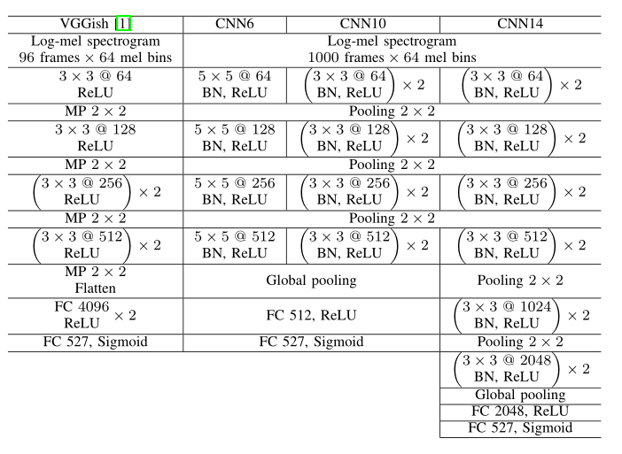
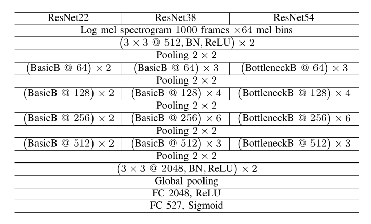
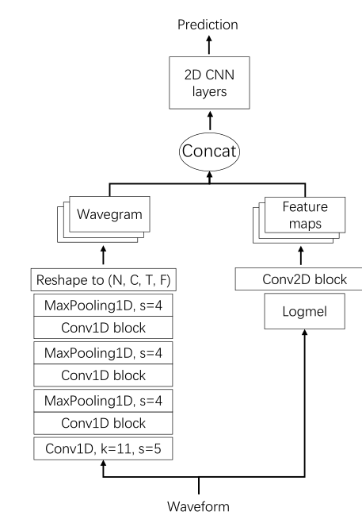

- [PANNs: Large-Scale Pretrained Audio Neural Networks for Audio Pattern Recognition(音频模式识别方向中大规模预训练的网络模型)](#panns-large-scale-pretrained-audio-neural-networks-for-audio-pattern-recognition音频模式识别方向中大规模预训练的网络模型)
  - [Abstract](#abstract)
  - [Introduce](#introduce)
  - [CNN SYSTEMS 基于CNN系列的模型](#cnn-systems-基于cnn系列的模型)
    - [CNN系列模型](#cnn系列模型)
    - [ResNet结构模型](#resnet结构模型)
    - [MobileNet](#mobilenet)
    - [一维卷积](#一维卷积)
      - [DaiNet](#dainet)
      - [LeeNet](#leenet)
      - [本文的处理](#本文的处理)
  - [Wavegram-CNN System 基于Wavegram和CNN的模型](#wavegram-cnn-system-基于wavegram和cnn的模型)
    - [Wavegram-CNN模型](#wavegram-cnn模型)
    - [数据处理](#数据处理)
      - [data balancing 数据平衡](#data-balancing-数据平衡)
      - [data augmentation 数据增强](#data-augmentation-数据增强)
        - [Mixup](#mixup)
        - [SpecAugment](#specaugment)
# PANNs: Large-Scale Pretrained Audio Neural Networks for Audio Pattern Recognition(音频模式识别方向中大规模预训练的网络模型)
## Abstract
音频模式识别时音频机器学习领域的重要研究方向之一，包括音频标签化、音频场景分类、音乐分类、语气情感分类、音频时间检测等。  
深度神经网络不断应用在音频模式识别任务中，但是大多仅用在少量数据的 特定数据集上。这与当前在图像领域中大规模数据预训练的模式有所差异。  
本文提出PANNs，在**大规模的AudioSet数据**上进行预训练，之后将模型迁移到其他音频任务上。  
本文同时对比了各种卷积神经网络建模的PANNs的性能和计算复杂性。  
最终提出了一个名为Wavegram-Logmel-CNN的结构，**同时使用梅尔频谱和waveform共同作为输入**。  

## Introduce
AudioSet是音频模式识别的里程碑工作，超过5000个小时的音频记录和527个音频分类，以分类任务为基础的是音频模式识别的数据集。  
文章在AudioSet上提出了基于神经网络的预训练模型，并且将其迁移到了其他的任务上。  
综合而言文章的贡献为：
1. 在AudioSet上的近200万个音频片上进行527类分类任务进行预训练；
2. 在不同的复杂度上进行了模型效果和计算复杂度之间的均衡tarde off；
3. 提出了称为Wavegram-Logmel-CNN的结构，达到了SOTA效果；
4. 在迁移到其他音频任务上也得到了SOTA的效果；
5. 公布了PANNs的源代码和模型参数

## CNN SYSTEMS 基于CNN系列的模型
音频标签化是音频模式识别的基本任务，判断音频片中是否存在音频标签。  
音频标签化主要有三种方法：
1. 使用人工设计的处理，如音频能量、MFCCs等等；
2. 生成式模型，如高斯混合模型(GMMs)，隐马尔科夫模型(HMMs)等；
3. 基于CNN的深度神经网络

### CNN系列模型
基于CNN的音频模型，**往往将log-mel-spectrogram即log域的梅尔频谱作为输入**，即使用短时傅里叶变换(STFT)计算为频谱图，之后转化为梅尔域，最终进行log化。  
模型结构就是经典的Alex-Net和VGG结构。值得注意的就是在最终加了全连接层进行模型泛化。  
**VGGish采用的是一秒的音频片段，即96frames，本模型采用的是整个音频，即10秒的音频，1000frames。**  
  
任务就被描述为了一个二分类任务，采用二分类的交叉熵函数。  
### ResNet结构模型
深度CNN往往比浅层CNN效果更好，但是往往会出现梯度消失的问题。残差结构在CNN结构中加入shortcut结构，使得梯度能够稳定传递，是解决深度CNN梯度消失的有效方法。  
对ResNet在音频领域上的使用，需要对log域的梅尔频谱首先进行卷积和池化降维，之后经过ResNet结构进行计算。  
  
### MobileNet
MobileNet是解决CNN和ResNet的计算过于复杂所提出的结构，通过1x1的卷积核进行简易化计算。  
[mobilenet](img/mobileNet.png)  
### 一维卷积
过往大多数的神经网络都是在频谱图的时域和频域上进行二维卷积，有些研究提出在**原始信号上使用一维卷积进行处理**。  
注意！**直接对原始waveform信号进行一维卷积，往往并不是能够优于log-mel-spectrogram，因为二维卷积捕获了时域和频域信息，而一维卷积没有频域轴，无法捕获不同音高的频域模式。**  
#### DaiNet
DaiNet通过使用长度为80，步长为4的一维卷积核，直接在音频的waveform上进行计算，之后利用大小为3的核步长为4的核进行后续特征抽取。  
#### LeeNet
LeeNet采用的是更小的卷积核，在第一层仅使用长度为4的一维卷积核，同时深度达到了11层。  
#### 本文的处理
在LeeNet的结构上将其深度扩展为24层，同时加入了一维的ResNet(Res1dNet)。  

## Wavegram-CNN System 基于Wavegram和CNN的模型
### Wavegram-CNN模型
Wavegram是本文提出的一种类似于log-梅尔频谱的一种特征，但是其是用神经网络学习的。**Wavegram同样具有时域和频域**。  
通过Wavegram的结构，学习一维CNN忽略的频域信息，频域对于音频任务是十分重要的。同时期望于Wavegram学习比短时傅里叶变换更好的特征。  
  
wavegram的来源是对原始的waveform进行一维卷积和池化之后，reshape到[channel, time, freq]的维度上，能够和经过2D CNN的结果进行concat。最后经过二维CNN进行预测输出。  
从可解释性来说，通过这种设计，可以同时利用波形图waveform和log梅尔频谱的信息，对waveform的一维卷积为音频提供了额外信息，补充了log频谱。  
### 数据处理
数据平衡(data balancing)和数据增强(data augmentation)是本文使用的数据处理方式。  
数据平衡是在高度不平衡数据上训练神经网络的技术，数据增强是对数据进行扩容，方式过拟合的过程。  
#### data balancing 数据平衡
在AudioSet数据集中，呈现明显的数据不平衡的现象，有90w的数据属于演讲和音乐；而牙刷的音频仅有十几个，呈现明显的长尾分布。  
本文使用的数据平衡策略就是从不同的分类中进行抽样，使得样本较为均衡。  
#### data augmentation 数据增强
数据增强是防止过拟合的有效手段。本文采用了两种策略，Mixup和SpecAugment。  
##### Mixup
Mixup是采用插值法，集中两段音频的输入和目标来扩充数据集的策略。  
假设音频的输入是x1,x2，而target是y1,y2，插值法使得x=λx1+(1-λ)x2，y=λy1+(1-λ)y2。  
##### SpecAugment
SpecAugment使用频域mask和时域mask进行数据增强，是经典的数据增强策略。  