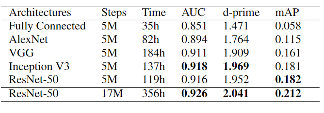
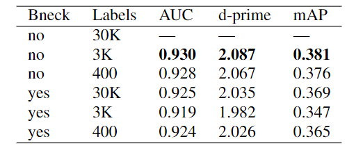
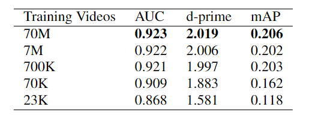

- [CNN ARCHITECTURES FOR LARGE-SCALE AUDIO CLASSIFICATION](#cnn-architectures-for-large-scale-audio-classification)
  - [ABSTRACT](#abstract)
  - [INTRODUCTION](#introduction)
  - [DATASET](#dataset)
  - [EXPERIMENTAL FRAMEWORK](#experimental-framework)
    - [Training](#training)
    - [Evaluation](#evaluation)
    - [Architectures](#architectures)
      - [Fully Connected](#fully-connected)
      - [AlexNet](#alexnet)
      - [VGG](#vgg)
      - [Inception V3](#inception-v3)
      - [ResNet-50](#resnet-50)
    - [EXPERIMENTS](#experiments)
      - [Architecture Comparison](#architecture-comparison)
      - [Label Set Size](#label-set-size)
      - [Training Set Size](#training-set-size)
# CNN ARCHITECTURES FOR LARGE-SCALE AUDIO CLASSIFICATION
## ABSTRACT
CNN已经被证明在图像分类任务上具有非常好的效果，同时其在音频上也有很高的潜力。  
使用一个70M个训练视频(共5.24M小时)，其中可以分为30871个video-level的l标签上，试验了多种CNN架构。  
尝试了：fully connected DNN, AlexNet, VGG, Inception, ResNet等架构。  
在不断改变训练数据集和标签集的过程中，CNN可以在音频分类上达到类似于图像分类上的效果；同时，越多的训练资料最终实现的效果越好。  
如果使用一个基于CNN的模型做embedding后，用于Acoustic Event Detection(AED)分类任务上时，相较于直接输入原始音频，效果会好很多。  

## INTRODUCTION
图像分类任务随着**基于CNN的网络(AlexNet VGG InceptionNet ResNet)和基于大数据集的预训练模型(ImageNet)的出现**，得到了飞速发展。  
作者尝试**结合CNN和大数据集预训练模式**，尝试解决音频方面的问题。  
使用的数据集具有70M训练视频(共5.24M小时)，其中可以分为30871(30K)个video-level的l标签，被称作YouTube-100M  
预训练任务是使用音频信息，进行video-level的标签分类任务(soundtrack classification)  
**通过这个过程，让machines去听、去理解音频**，之后进行分类、组织、索引等任务  
具体的实验而言：
1. 对比在YouTube-100M数据集在视频音轨分类任务上，哪种流行的CNN模型效果比较好？
2. 不同的训练数据和label的大小对模型效果的影响如何？
3. 预训练的模型是否可以应用到别的任务->AED(Acoustic Event Detection)上？

过去AED任务**往往将音频特征抽取为MFCC** 之后使用GMM，HMM, NMF, SVM进行分类 之后使用CNN和RNN的模型，进行处理  
过去进行AED任务的数据集规模不足，相较于YouTube-100M小，使用大数据集能够在进行模型验证时得到更好的效果。  

**模型使用的是不重叠的片段**，(很多acoustic任务，都是使用带有重叠的片段)  
**通过计算多帧的log-mel spectrogram，就构建了一个类似2D图像的表示形式 (尽管对时域和频域做2D卷积可能只支持于音频领域)**  

## DATASET
YouTube-100M数据集包含了：70M的训练数据， 10M的测试数据 和 20M的验证数据。  
平均视频长度是4.6分钟，每个视频被标记为了一个或多个标签(共有30871种标签)，平均有五个标签  
标签从"Song"这种比较抽象的标签，到"Lecturer"这种比较细分的标签  

## EXPERIMENTAL FRAMEWORK
### Training
**音频划分为无重叠的960ms的音频帧 每个音频帧都被标记上其所属视频的标签**  
**960ms的音频帧通过短时傅里叶变换进行压缩(每10ms应用一个25ms的窗口进行压缩)**  
**之后取log再加上bias，最终得到的64 mel-spaced frequency bins的频谱图**
因为每10ms一个短时傅里叶变换，那么就是96维的时域；梅尔频谱图的维度是64维，就是频域64维。所以最终维度是[96, 64]  

### Evaluation
对于评价指标，使用了AUC值和mAP(mean Average Precision)

### Architectures
#### Fully Connected
全连接层+RELU (N层 每层M units) 最终使用N=3 M=1000 LR=3*10-5  
全连接层方法作为Baseline  
#### AlexNet
原始AlexNet架构使用11 * 11的卷积核，以4为步长，输入图像为224 * 224 * 3  
音频上的输入是96 * 64，使用步长为2 * 1这样就可以保证卷积后维度不变  
同时在卷积层之后使用了Batch Norm的方法 最后一层使用3087维，做3087维分类  
#### VGG
对VGG的改变仅仅是最后一层使用3087维分类，同时使用batch norm的方法，stride仍然和AlexNet相同是(2,1)  
#### Inception V3
对Inception V3的修改是移除了初始的四层，同时移除了auxiliary network  
将average pool的大小变为10 * 6  
#### ResNet-50
对ResNet-50的处理是移除了第一层7 * 7卷积层 将Average Pool大小变为6 * 4  

### EXPERIMENTS
#### Architecture Comparison
对比各个模型的效果：  
  
InceptionNet和ResNet得到了最好的效果，这就证明了，**卷积单元可以非常有效的捕获音频不同区域的输入信息**  

#### Label Set Size
对比不同的label大小得到的效果：  
  
Bottleneck代表是否将倒数第二层限制在128维  
可以说明no-Bottleneck同时labels越大得到的效果越好  

#### Training Set Size
对比训练集视频数对结果的影响：  
  
效果上还是数据集越大越好  